本储存库是从网络上收集的一些高质量的计算机科学与技术电子书籍。包含了计算机大多数软件相关方向。

## 📘 具体内容

🌟 **计算机基础**（计算机概论、组成原理、操作系统、计算机网络、数据结构、算法等）；

🌟 **编程语言**（C、CPP、C#、Rust、Java、Go、Python、SQL、JavaScript、PHP、Ruby、Matlab、Latex等）；

🌟 **软件工程**（产品经理、软件架构、调试测试等）；

🌟 **数学工具**（基础数学、应用数学等）；

🌟 **大数据**（数据分析、数据挖掘等）；

🌟 **人工智能**（机器学习、深度学习、强化学习等）；

🌟 **生存指南**（生存指南、考证、面试等）。

书籍根据个人理解和爱好分类，找不到的可以搜索试试。

## 🏆 特点

🌟 **精**

* 书在于精而不在于多（读懂一本好书胜过读十本烂书，本书库不求书多，只求书精，书多反而使人眼花缭乱，无从下手）;

* 本书库的书籍都是个方向经典书籍（通过各平台纸质书籍销量、豆瓣评分、大佬推荐得到本书库书目，经过大众的检验，符合大部分人学习习惯）。

🌟 **质**

* 一本高质量的电子书可以提升人的阅读兴趣（本书库收集的为全网质量最高的书籍，90%以上为原版书籍 [文字可复制]，仅10%为高清扫描版）;

* 非EPUB等格式转换PDF（转换的PDF格式比较乱，本书库都是PDF原版格式，和纸质书籍格式相同）;

* 无广告（书籍中无广告推广，阅读更清爽）。

🌟 **新**

* 本书库中书籍保持最新版本（计算机技术迭代速度快，新书有利于新技术的学习）。

## 🚀 食用指南

* 点击书籍封面跳转百度网盘链接。点击书籍名称跳转阿里云盘链接（阿里云盘不限速，可使用蜗牛云盘客户端提速下载）。点击直链下载添砖123盘链接（不需要客户端，网页下载不限速）。

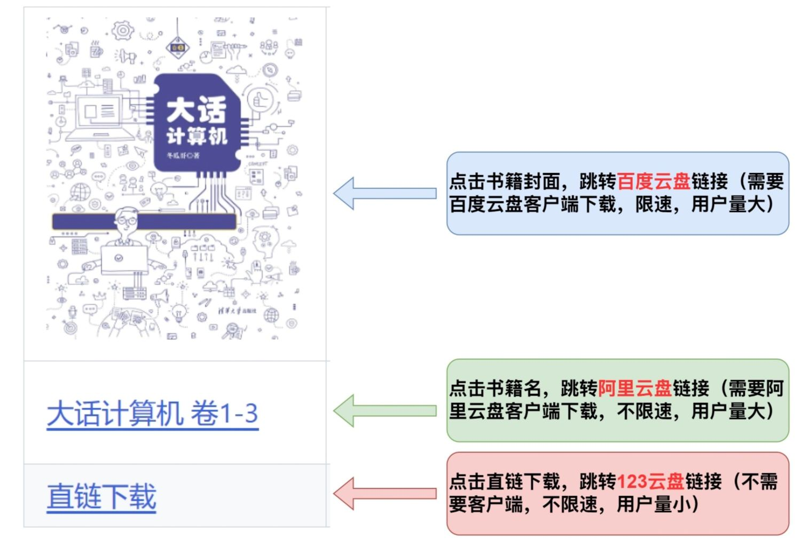

* 为防止和谐，压缩为zip格式，无解压密码。

* 一个链接中可能不止一本书，系列书籍、配套书籍或者不同版本差距较大的书籍可能放在一个链接里。

* 如果本书库未收录，可以通过 [Z-Library](https://zh.zlibrary-east.se)(全球最大的开源图书馆) 检索，上面书籍较多，但是质量不如本书库。

## ⚠️ 声明

此书库资源均来源于网络，仅供个人学习参考，**不用于商业用途**
。下载查看后于24小时内删除。如果觉得书写的不错，一定要买一本纸质版支持一下作者。无意侵权，我只是网络的搬运工。如有侵权请联系本人删除或提交issue。

# 计算机基础

计算机概论

|  |  |  | <a href="https://pan.baidu.com/s/1vmY9h5DOxZLXZ5w-5TNvrg?pwd=hga8"> 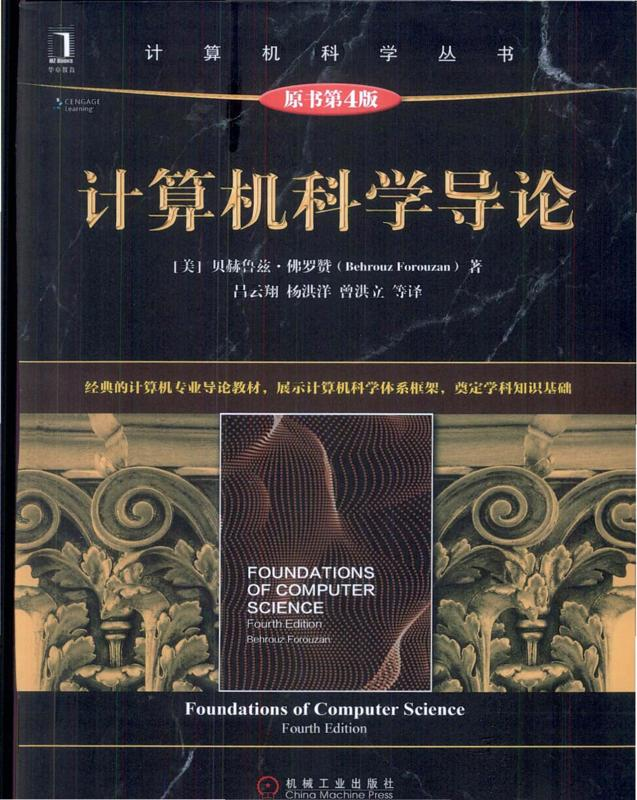</a> |
|-----------------------------------------------------------------------------------------------------------------------------------|------------------------------------------------------------------------------------------------------------------------------------------|---------------------------------------------------------------------------------------------------------------------------------------|------------------------------------------------------------------------------------------------------------------------------------|
| <a href="https://www.alipan.com/s/g1qofMgFbPf"> 大话计算机 卷1-3 </a>                                                                   | <a href="https://www.alipan.com/s/Dn2cpMBciWm">计算机科学技术百科全书  (第三版) </a>                                                                | <a href="https://www.alipan.com/s/p6ypjRUM8a3">计算机科学概论  (第13版)  </a>                                                               | <a href="https://www.alipan.com/s/Lfe3mDEWB1W">计算机科学导论 （第4版）</a>                                                                |

组成原理

|  |  | <a href="https://pan.baidu.com/s/1IMt-mSkY9V-P_PoRmnpuTQ?pwd=5a8f"> 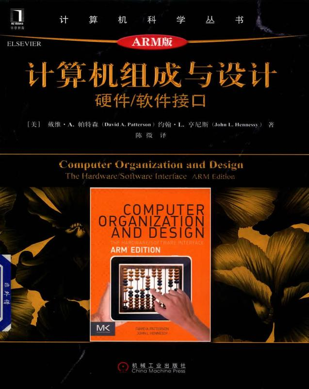</a> | <a href="https://pan.baidu.com/s/1OecPfXZpa4OZrXlSHe3pXQ?pwd=9h9p"> 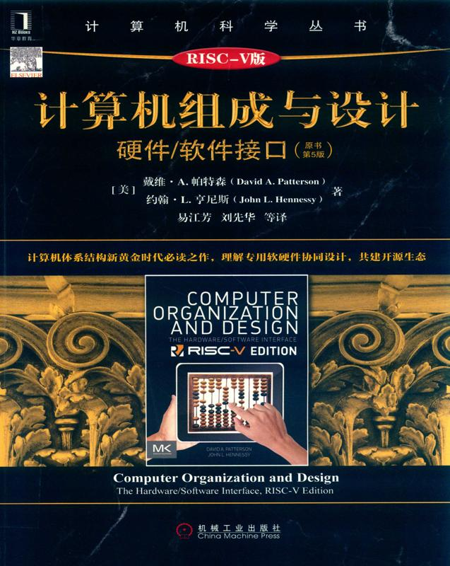</a> | <a href="https://pan.baidu.com/s/1e-bqmc7h9YrZrbrCL0PMNw?pwd=l2tv"> 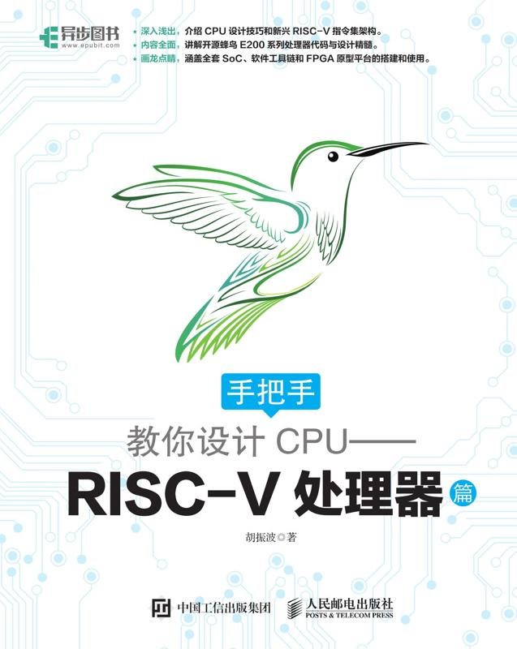</a> |
|------------------------------------------------------------------------------------------------------------------------------------------|---------------------------------------------------------------------------------------------------------------------------------------------|---------------------------------------------------------------------------------------------------------------------------------------------|------------------------------------------------------------------------------------------------------------------------------------------------|--------------------------------------------------------------------------------------------------------------------------------------------|
| <a href="https://www.alipan.com/s/FD8mBbFuqZB">计算机组成  （原书第6版）</a>                                                                     | <a href="https://www.alipan.com/s/1QwPYe4ct4h">计算机组成与设计   (第5版) </a>                                                                     | <a href="https://www.alipan.com/s/1umtK2j415K">计算机组成与设计 （ARM版）</a>                                                                       | <a href="https://www.alipan.com/s/Rw8dikD3Hod">计算机组成与设计 （原书第5版·RISC-V版）</a>                                                                 | <a href="">手把手教你设计 CPU-RISC-V处理器篇 </a>                                                                                                  |

|  | <a href="https://pan.baidu.com/s/1aWKmCn6I8T38Z4oM_GrRAQ?pwd=l1ar"> 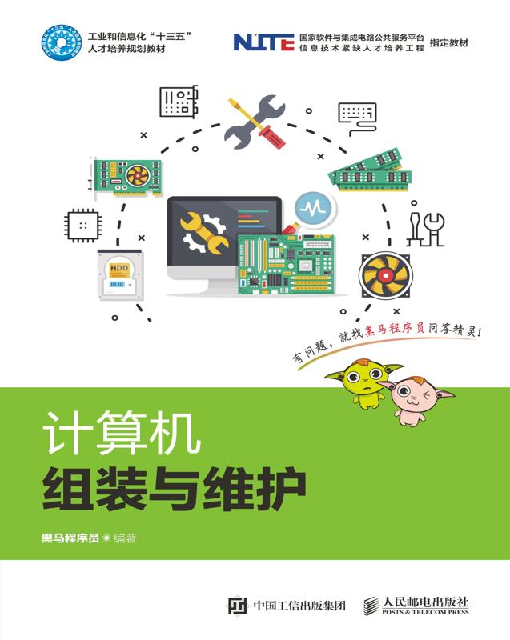</a> |
|---------------------------------------------------------------------------------------------------------------------------------------|-------------------------------------------------------------------------------------------------------------------------------|
| <a href="https://www.alipan.com/s/k6z14xKj6be">电脑组装、维护、维修 全能一本通 </a>                                                               | <a href="https://www.alipan.com/s/yAeBRvenD41">计算机组装与维护 </a>                                                                  |

计算机网络

|  |  | <a href="https://pan.baidu.com/s/1Fjixqx-m_wP6Ce-9yCQBZA?pwd=0o4m"> 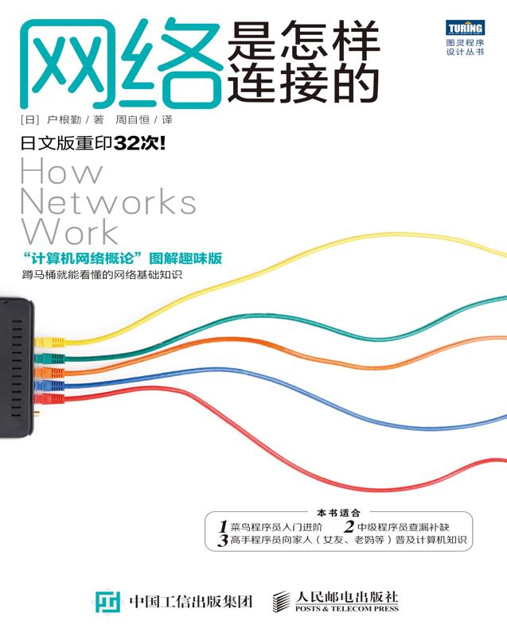</a> |  |  |
|-----------------------------------------------------------------------------------------------------------------------------------|-------------------------------------------------------------------------------------------------------------------------------------------|---------------------------------------------------------------------------------------------------------------------------------|---------------------------------------------------------------------------------------------------------------------------------------|----------------------------------------------------------------------------------------------------------------------------------------|
| <a href="https://www.alipan.com/s/S6xPBfxvwxp">计算机网络 (第8版) </a>                                                                   | <a href="https://www.alipan.com/s/jobr2KKh3eV">计算机网络  自顶向下方法 (第七版)</a>                                                                 | <a href="https://www.alipan.com/s/4NfN65N4vYe">网络是怎样连接的</a>                                                                     | <a href="https://www.alipan.com/s/GpK7BFdebG1">TCP IP详解 (第2版)</a>                                                                     | <a href="https://www.alipan.com/s/aYNoVNqdEbJ">计算机网络  系统方法 (第5版)</a>                                                                |

| <a href="https://pan.baidu.com/s/1PYhWooeO83keGyhpIPm01Q?pwd=2tnc"> 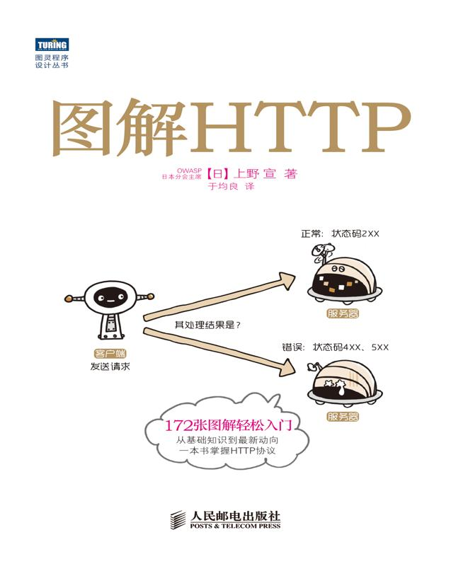</a> | <a href="https://pan.baidu.com/s/1qRwyW-Vtc8HwEEMxcjk3lg?pwd=e2mn"> 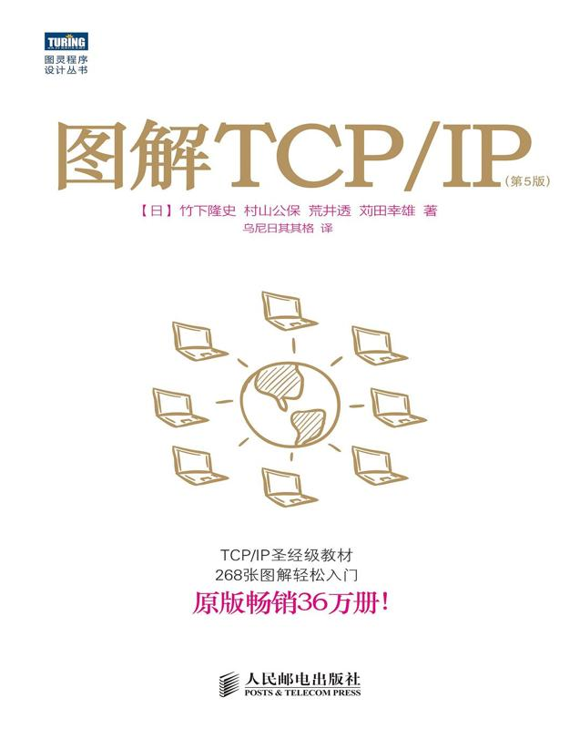</a> |
|-------------------------------------------------------------------------------------------------------------------------------|---------------------------------------------------------------------------------------------------------------------------------|
| <a href="https://www.alipan.com/s/fsoQUxXTeD4">图解HTTP </a>                                                                    | <a href="https://www.alipan.com/s/769p4FHRVnu">图解TCPIP协议</a>                                                                    |

操作系统

| <a href="https://pan.baidu.com/s/1ORueUDElxP19tWReuQX2dg?pwd=2ujj"> 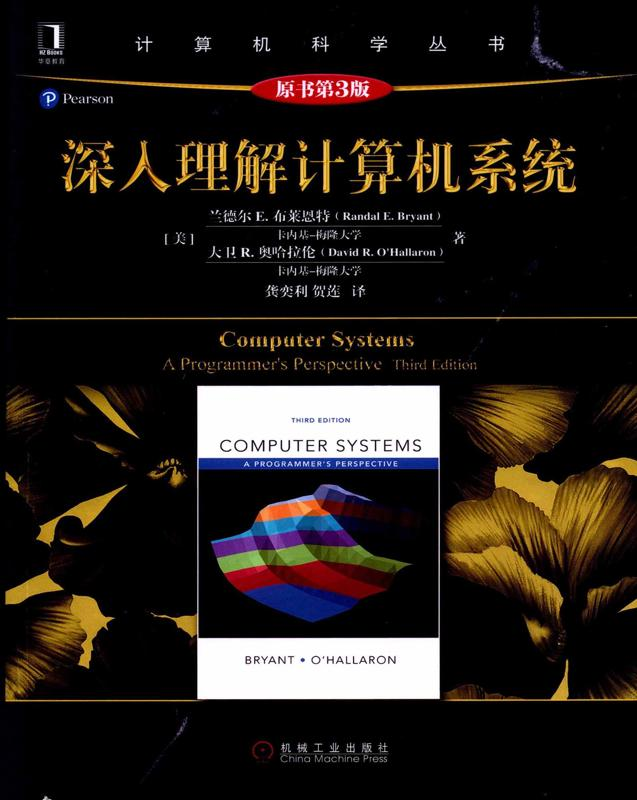</a> |  | <a href="https://pan.baidu.com/s/1HDTfNKiGh5ephCIoFu3srA?pwd=1t8p"> 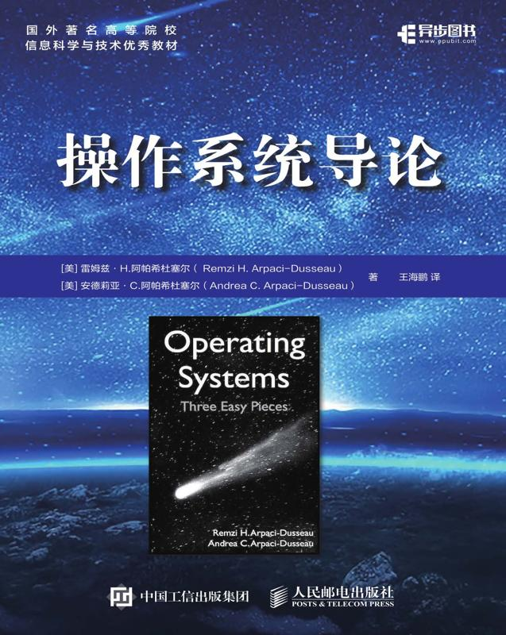</a> |
|----------------------------------------------------------------------------------------------------------------------------------------|------------------------------------------------------------------------------------------------------------------------------------|-----------------------------------------------------------------------------------------------------------------------------|
| <a href="https://www.alipan.com/s/Sat2rdg6Fbi">深入理解计算机系统 （原书第3版）</a>                                                                | <a href="https://www.alipan.com/s/2iXQeG3fvup">现代操作系统  (第4版)</a>                                                                | <a href="https://www.alipan.com/s/uqDF6vurRyQ">操作系统导论</a>                                                                   |

算法与数据结构

| <a href="https://pan.baidu.com/s/1sR7j9llPp3HRHSPpOIpwTw?pwd=a0l0"> 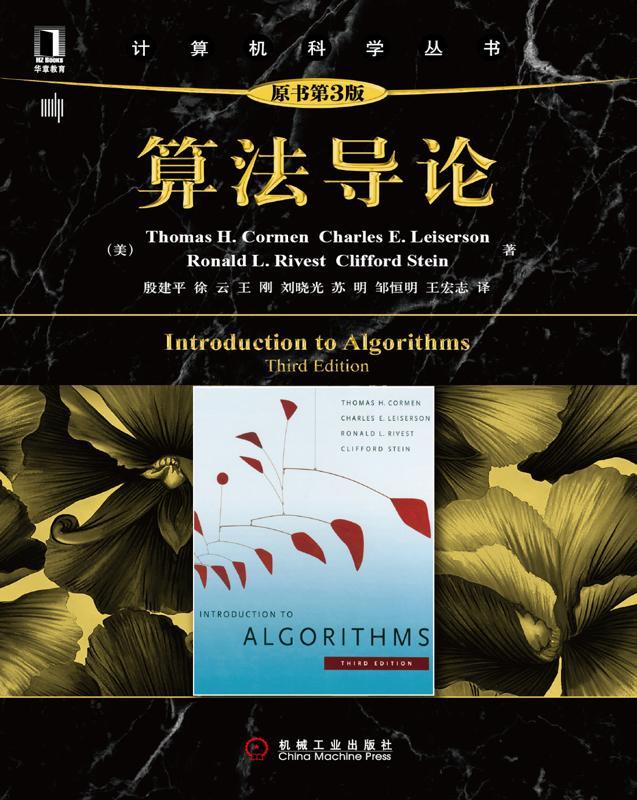</a> |  | <a href="https://pan.baidu.com/s/1Ua_xvIPOv1S1tY0AAm_FIQ?pwd=h5hz"> 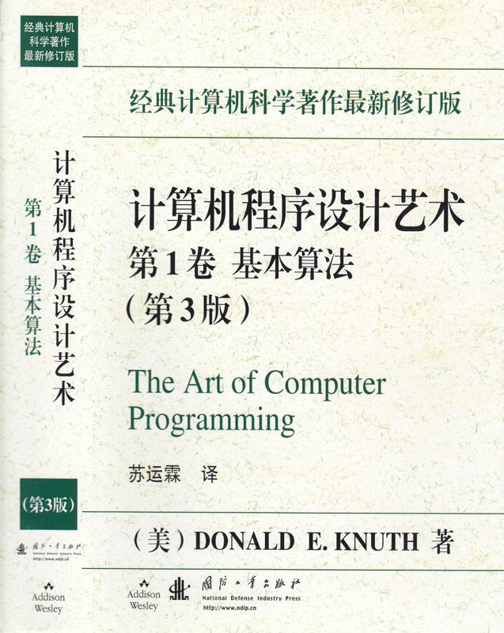</a> |  |  |
|-------------------------------------------------------------------------------------------------------------------------------------|------------------------------------------------------------------------------------------------------------------------------------|-------------------------------------------------------------------------------------------------------------------------------------|-------------------------------------------------------------------------------------------------------------------------------------------|----------------------------------------------------------------------------------------------------------------------------------------------------|
| <a href="https://www.alipan.com/s/r8eYmJbJUxr">算法导论 （原书第3版） </a>                                                                 | <a href="https://www.alipan.com/s/onX4vQo4BUU">算法  (第4版)</a>                                                                       | <a href="https://www.alipan.com/s/3WApt2njUeb">计算机程序设计艺术</a>                                                                        | <a href="https://www.alipan.com/s/bhzGFf9qpvN">labuladong的 算法小抄</a>                                                                    | <a href="https://www.alipan.com/s/Rj43DnmAnUB">LeetCode 101  (C++ Version)</a>                                                                  |

| <a href="https://pan.baidu.com/s/1mz0EYOdjeHlzSqRcZnw8XQ?pwd=8s2z"> 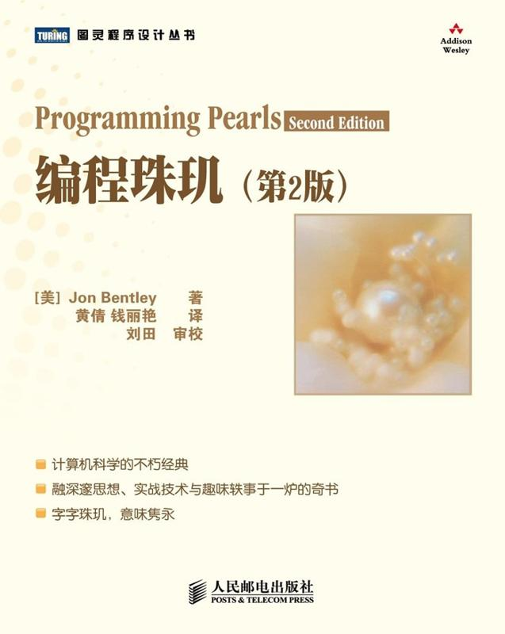</a> |  |  |  |  |
|------------------------------------------------------------------------------------------------------------------------------|----------------------------------------------------------------------------------------------------------------------------------------|-------------------------------------------------------------------------------------------------------------------------------|---------------------------------------------------------------------------------------------------------------------------------------|------------------------------------------------------------------------------------------------------------------------------------|
| <a href="https://www.alipan.com/s/xUP6iZ1Sdzn">编程珠玑 </a>                                                                     | <a href="https://www.alipan.com/s/eeAsgwBcBTc">大话数据结构 【溢彩加强版】</a>                                                                   | <a href="https://www.alipan.com/s/RGbK2uyV7fF">算法图解</a>                                                                       | <a href="https://www.alipan.com/s/bMwd38mCGTA">漫画算法 小灰的算法之旅</a>                                                                       | <a href="https://www.alipan.com/s/fG8Qv4PXj6t">数据结构 (第3版)</a>                                                                      |

|  | <a href="https://pan.baidu.com/s/15jGZTS8fPogcwl_V55U6Bg?pwd=ubrj"> 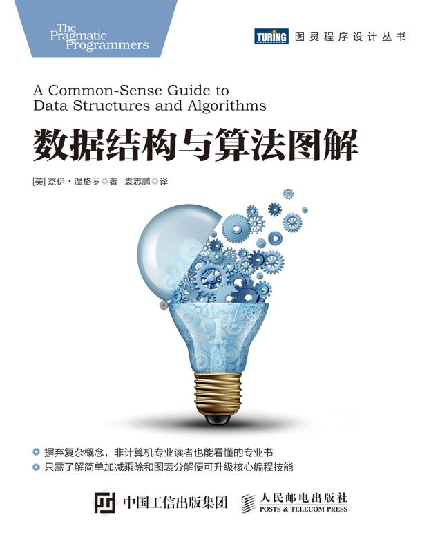</a> | <a href="https://pan.baidu.com/s/1Up0sPQlJ6uqV0ElN6TgYGA?pwd=1124"> 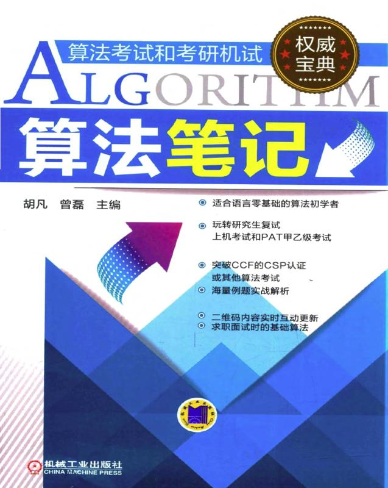</a> |  |  |
|------------------------------------------------------------------------------------------------------------------------------------------------|------------------------------------------------------------------------------------------------------------------------------------|-------------------------------------------------------------------------------------------------------------------------------|-------------------------------------------------------------------------------------------------------------------------------|-----------------------------------------------------------------------------------------------------------------------------------------|
| <a href="https://www.alipan.com/s/SgtVfwBSweh">数据结构与算法分析  C语言描述（原书第2版）</a>                                                                  | <a href="https://www.alipan.com/s/5vDkke4xZic">数据结构与算法图解</a>                                                                       | <a href="https://www.alipan.com/s/zi4ECPaeEFM">算法笔记</a>                                                                       | <a href="https://www.alipan.com/s/KZUTSq15Pzi">算法精粹</a>                                                                       | <a href="https://www.alipan.com/s/zThkQbHsecX">算法设计与分析基础  (第3版)</a>                                                                  |

# 编程语言

编程工具

|  |  |  |
|----------------------------------------------------------------------------------------------------------------------------------------------|----------------------------------------------------------------------------------------------------------------------------------|----------------------------------------------------------------------------------------------------------------------------------|
| <a href="https://www.alipan.com/s/VUWHzwYbbvA">PyCharm 中文指南 （Win版）v2.0</a>                                                                | <a href="https://www.alipan.com/s/DT4WFceobSd">VSCode权威指南</a>                                                                    | <a href="https://www.alipan.com/s/vNaPvAiRtxv">精通Git (第2版)</a>                                                                   |

C

| <a href="https://pan.baidu.com/s/10QgyuoIXaGdvHTwNlKKCBw?pwd=e1h7"> 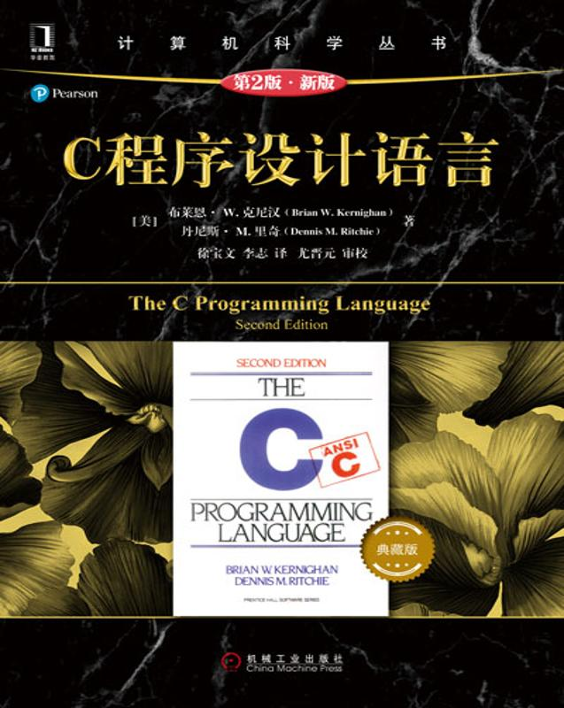</a> |  |  |  |
|--------------------------------------------------------------------------------------------------------------------------------|---------------------------------------------------------------------------------------------------------------------------------------|-------------------------------------------------------------------------------------------------------------------------------------------|-----------------------------------------------------------------|
| <a href="https://www.alipan.com/s/zNk7Ht8S8cU">C程序设计语言 （第2版）</a>                                                            | <a href="https://www.alipan.com/s/5x4hnhT4e1k">C Primer Plus （第6版）</a>                                                             | <a href="https://www.alipan.com/s/TJxw1YR2Krt">C语言程序设计 现代方法 (第2版修订版)</a>                                                               | <a href="">C和指针</a>                                             |

Cpp

|  |  |  |  | <a href="https://www.aliyundrive.com/s/xdssexskRE7"> 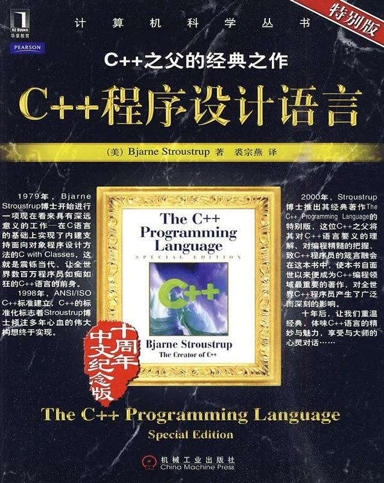</a> |
|--------------------------------------------------------------------------------------------------------------------------------------|-----------------------------------------------------------------------------------------------------------------------------------------|--------------------------------------------------------------------------------------------------------------------------------------------|------------------------------------------------------------------------------------------------------------------------------------|---------------------------------------------------------------------------------------------------------------------|
| <a href="https://www.alipan.com/s/phhxDDM4xLv">C++ Primer (第5版)</a>                                                               | <a href="https://www.alipan.com/s/uU5gTek5zgi">C++ Primer习题集 （第5版）</a>                                                               | <a href="https://www.alipan.com/s/VWDSo62acBH">C++ Primer Plus  (第6版)</a>                                                               | <a href="https://www.alipan.com/s/LcZU2oTk6yr">C++标准库 (第2版)</a>                                                                 | <a href="">C++程序设计语言 （特别版）</a>                                                                                   |

|  |  |  |  |  |
|-------------------------------------------------------------------------------------------------------------------------------------------|------------------------------------------------------------------------------------------------------------------------------------------|-------------------------------------------------------------------------------------------------------------------------------------|------------------------------------------------------------------------------------|----------------------------------------------------------------------------------------------------------------------------------------|
| <a href="https://www.alipan.com/s/3LuFZw73Pun">C++程序设计语言 第1～3部分（第4版）</a>                                                               | <a href="https://www.alipan.com/s/Kypmr3vsaTz">C++程序设计语言 第4部分（第4版）</a>                                                                | <a href="https://www.alipan.com/s/npd8J4Q31yk">C++20高级编程 （第5版）</a>                                                               | <a href="https://www.alipan.com/s/Zp58mGTPZR4">Effective Modern C++ </a>           | <a href="https://www.alipan.com/s/YUDmPt6X3jz">More Effective C++</a>                                                                  |

| <a href="https://pan.baidu.com/s/1NzsNEIhiLIGQv8qBQoDlHA?pwd=toi5"> 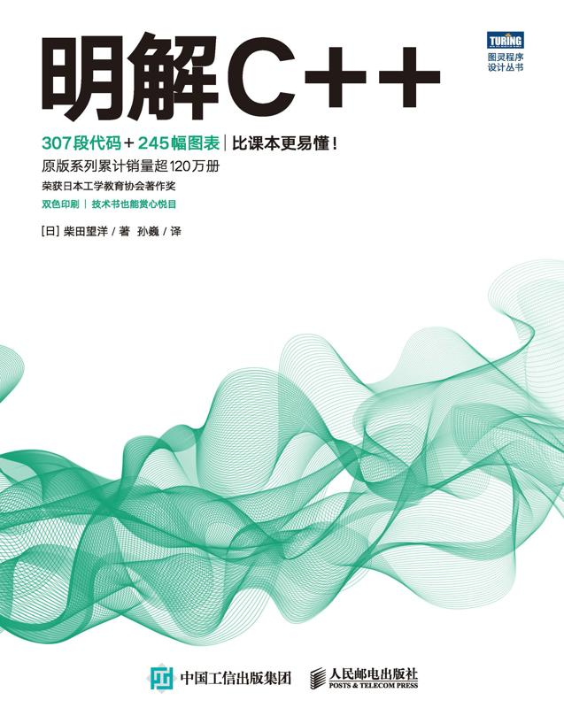</a> |  | 
|---------------------------------------------------------------------------------------------------------------------------|----------------------------------------------------------------------------------------------------------------------------------------------|
| <a href="https://www.alipan.com/s/rYQn4zqbZ9q">明解C++</a>                                                                  | <a href="https://www.alipan.com/s/YvD5UsQpn1u">C++ Templates  (第2版·中文版)</a>                                                               | 

C#

|  |  |
|-----------------------------------------------------------------------------------------------------------------------------------|---------------------------------------------------------------------------------------------------------------------------------------|
| <a href="https://www.alipan.com/s/m9MKHxUAkHm">深入理解C# （第3版）</a>                                                                | <a href="https://www.alipan.com/s/7WYAZPwmP2X">C# 图解教程 (第5版)</a>                                                                   | 

Rust

|  | <a href="https://www.aliyundrive.com/s/4Z8meSc2ZXa"> 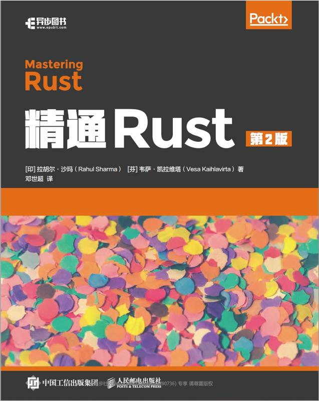</a> |
|-------------------------------------------------------------------------------------------------------------------------------------|--------------------------------------------------------------------------------------------------------------------|
| <a href="https://www.alipan.com/s/ifGCq5S14uf">Rust 程序设计 （第2版）</a>                                                               | <a href="https://www.alipan.com/s/4jXANaM493f">精通Rust(第2版)</a>                                                     | 

Java

|  | <a href="https://pan.baidu.com/s/1FZdia1LC9HkUV8ErPUGXeA?pwd=02gd"> 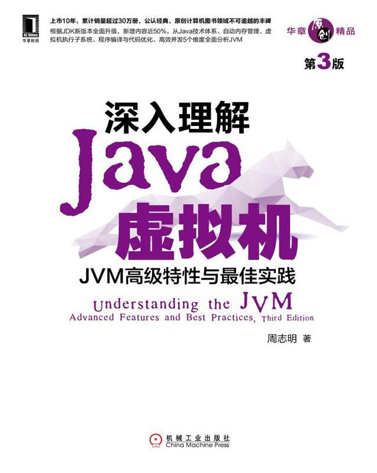</a> | <a href="https://pan.baidu.com/s/12LYkRbHu-p1s8Ke730gehA?pwd=ozy4"> 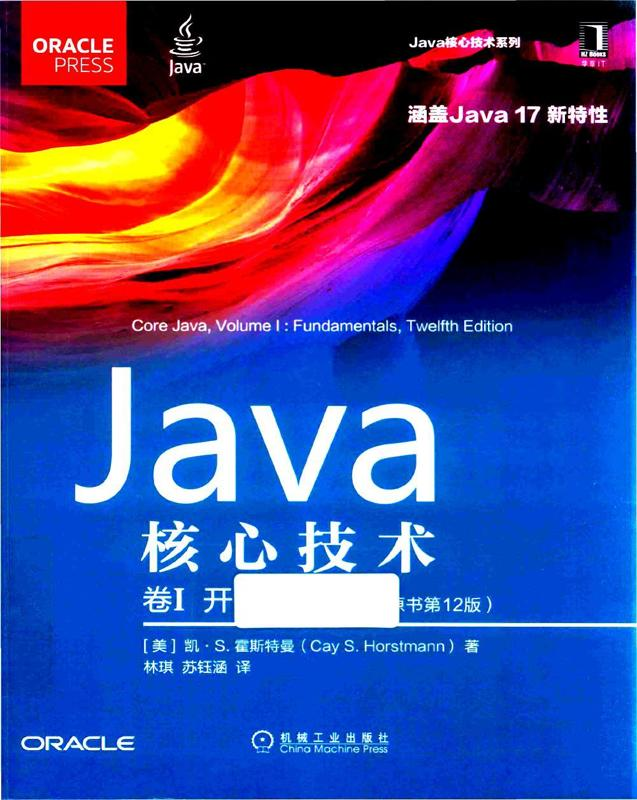</a> |  |  |
|-------------------------------------------------------------------------------------------------------------------------------------|----------------------------------------------------------------------------------------------------------------------------------------|-------------------------------------------------------------------------------------------------------------------------------------------|------------------------------------------------------------------------------------------------------------------------------------|-------------------------------------------------------------------------------------------------------------------------------------------|
| <a href="https://www.alipan.com/s/4ffqPtfGaX8">Java编程思想  (第5版)</a>                                                               | <a href="https://www.alipan.com/s/ccYNiYVwDT5">深入理解Java虚拟机 （第3版）</a>                                                                | <a href="https://www.alipan.com/s/Cmo8SeTtZEJ">Java核心技术 （原书第12版）</a>                                                                   | <a href="https://www.alipan.com/s/5eEypz2BzcC">Java实战 (第2版)</a>                                                                    | <a href="https://www.alipan.com/s/Gez5WokoHTN">Effective Java  (第3版)</a>                                                               |

|  |  |  |  | <a href="https://pan.baidu.com/s/1EDdzHGrIPhyNEocjYP-T_A?pwd=me3e"> 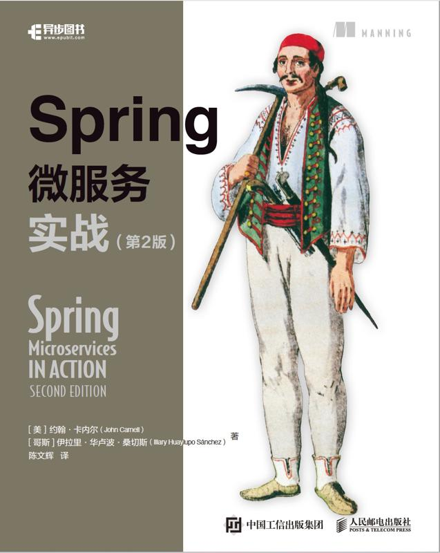</a> |
|---------------------------------------------------------------------------------------------------------------------------------------|--------------------------------------------------------------------------------------------------------------------------------------|-------------------------------------------------------------------------------------------------------------------------------------|-------------------------------------------------------------------------------------------------------------------------------------|---------------------------------------------------------------------------------------------------------------------------------------|
| <a href="https://www.alipan.com/s/x4LocP9KGVa">spring boot Vue3</a>                                                                   | <a href="https://www.alipan.com/s/q6K6mnsiyry">spring boot实战</a>                                                                     | <a href="https://www.alipan.com/s/vN35sxB8caT">Spring Boot实战</a>                                                                    | <a href="https://www.alipan.com/s/g8QXrSg7rwk">Spring实战（第6版）</a>                                                                    | <a href="https://www.alipan.com/s/rEPEpC6MLzV">Spring微服务实战 （第2版）</a>                                                               |

| <a href="https://pan.baidu.com/s/1bU55hYyCbMy-jGJ6_dYHAg?pwd=bic0"> 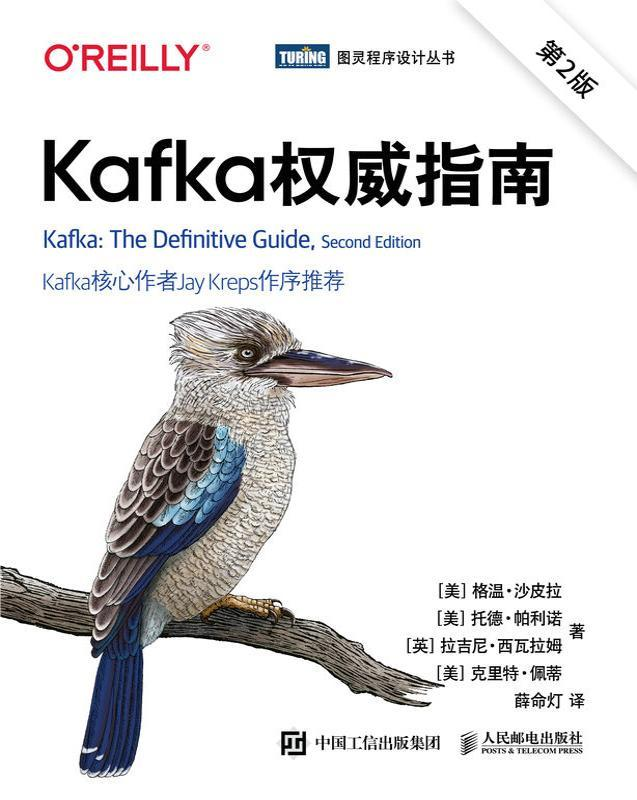</a> | <a href="https://pan.baidu.com/s/1UvwQJ0B0getRn_crvLAKnQ?pwd=gm2c"> 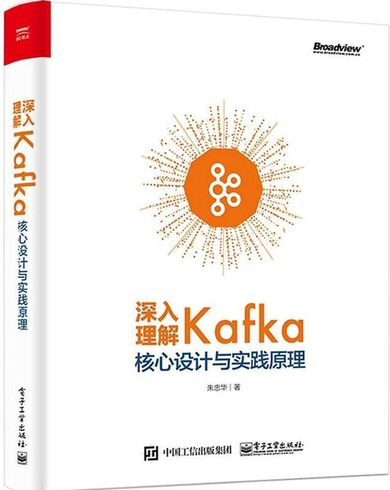</a> | <a href="https://pan.baidu.com/s/1ps1GE9gPkC2ziMDSDFJVaw?pwd=r22u"> 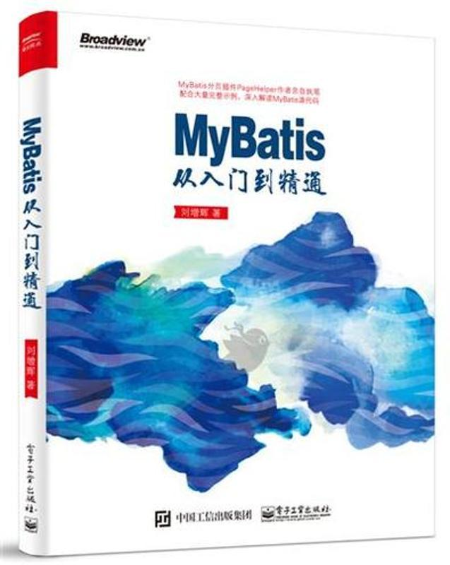</a> |
|--------------------------------------------------------------------------------------------------------------------------------------|-------------------------------------------------------------------------------------------------------------------------------------------|------------------------------------------------------------------------------------------------------------------------------------|
| <a href="https://www.alipan.com/s/Rngc3TxV7SV">Kafka权威指南 （第2版）</a>                                                                | <a href="https://www.alipan.com/s/eskR7nw33jx">深入理解Kafka： 核心设计与实践原理</a>                                                                | <a href="https://www.alipan.com/s/61hdKK4aphv">MyBatis 从入门到精通</a>                                                               |

Go

| <a href="https://pan.baidu.com/s/16Uh_njzMnrYrLQ6CADEbhg?pwd=2rs0"> 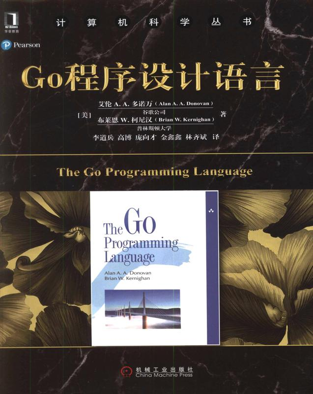</a> |  |
|----------------------------------------------------------------------------------------------------------------------------|-----------------------------------------------------------------------------------------------------------------------------|
| <a href="https://www.alipan.com/s/BTkquPb1x7k">Go程序设计语言</a>                                                                | <a href="https://www.alipan.com/s/3vutQ494Hcc">Go语言学习笔记</a>                                                                 |

Python

|  |  |  |  |  |
|--------------------------------------------------------------------------------------------------------------------------------------|-------------------------------------------------------------------------------------------------------------------------------------------|---------------------------------------------------------------------------------------------------------------------------------------|---------------------------------------------------------------------------------------------------------------------------------------|--------------------------------------------------------------------------------------------------------------------------------------------|
| <a href="https://www.alipan.com/s/Sojww8TLkkr">Effect Python</a>                                                                     | <a href="https://www.alipan.com/s/oYeWF6GNhss">Flash Web开发  (第2版)</a>                                                                  | <a href="https://www.alipan.com/s/GY3kScDD95b">Flask Web开发实战</a>                                                                      | <a href="https://www.alipan.com/s/Rj3ys2cn5J8">Pandas数据处理与分析</a>                                                                      | <a href="https://www.alipan.com/s/GgjPWoowxtH">Python asyncio  并发编程</a>                                                                 |

|  |  | <a href="https://pan.baidu.com/s/1aH8hmdrs8J7oLMuZE2gb6g?pwd=hcl6"> 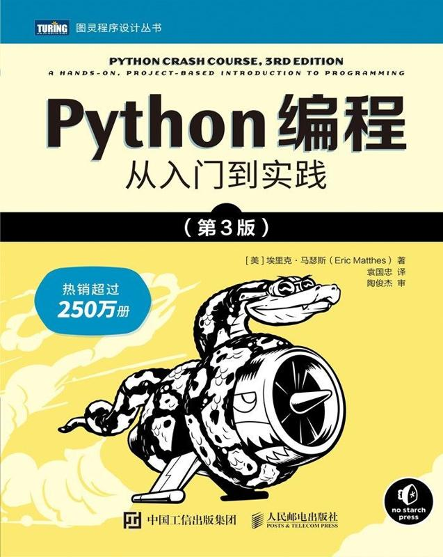</a> |  | <a href="https://pan.baidu.com/s/1Kzv0rSzk0hwBmfh5EA8oPw?pwd=1fy0"> 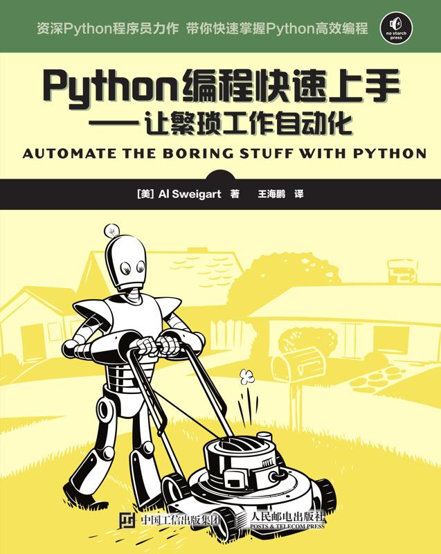</a> |
|----------------------------------------------------------------------------------------------------------------------------------------------|---------------------------------------------------------------------------------------------------------------------------------------------|----------------------------------------------------------------------------------------------------------------------------------------------|------------------------------------------------------------------------------------------------------------------------------------------|---------------------------------------------------------------------------------------------------------------------------------------|
| <a href="https://www.alipan.com/s/Kb95aPfhGtV">Python Qt GUI与 数据可视化编程</a>                                                                 | <a href="https://www.alipan.com/s/S66M95RF9d1">Python3网络爬虫 开发实战 第2版</a>                                                                  | <a href="https://www.alipan.com/s/pRjFt5dDAGy">Python编程 从入门到实践 （第3版）</a>                                                               | <a href="https://www.alipan.com/s/9F3uf6qBC1C">Python基础教程  (第3版)</a>                                                                  | <a href="https://www.alipan.com/s/JUSuXLJzV6E">Python让繁琐工作 自动化</a>                                                                 |

|  | <a href="https://pan.baidu.com/s/1GGXo7kOhJiLxbQeUDIq02A?pwd=exah"> 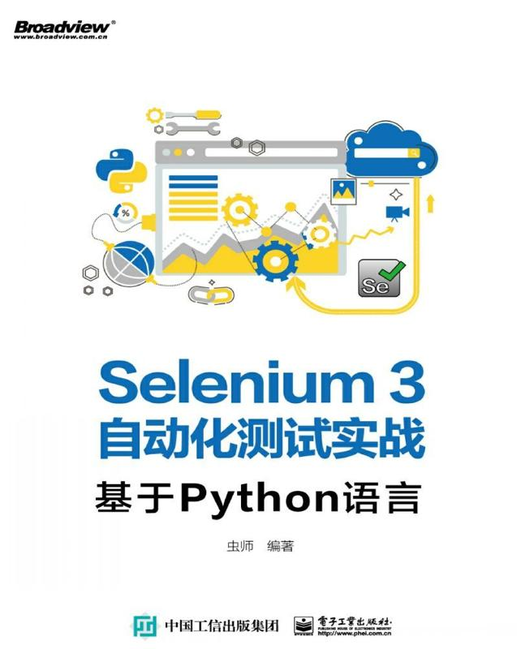</a> |  |  | <a href="https://pan.baidu.com/s/1eb6jS1HhxwEAbgcUqYwCdw?pwd=o157"> 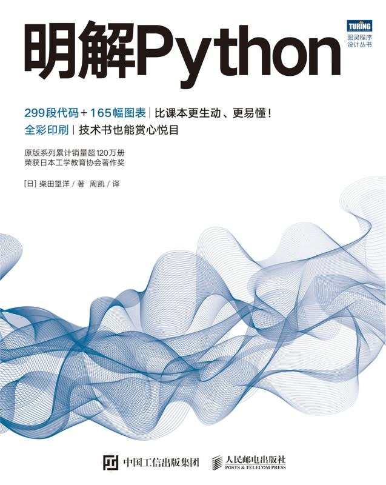</a> |
|---------------------------------------------------------------------------------------------------------------------------------------------|------------------------------------------------------------------------------------------------------------------------------------------|------------------------------------------------------------------------------------------------------------------------------------------------|-----------------------------------------------------------------------------------------------------------------------------------------|---------------------------------------------------------------------------------------------------------------------------------|
| <a href="https://www.alipan.com/s/CuiQeRtH67D">Python网络爬虫权威 指南 (第2版)</a>                                                                 | <a href="https://www.alipan.com/s/WoCRcmjcVXC">Selenium3自动化测 试实战</a>                                                                  | <a href="https://www.alipan.com/s/5UZbLqABvCU">SQLAlchemy  Python数据库实战</a>                                                                  | <a href="https://www.alipan.com/s/fVSQC96Lifp">流畅的 Python（第2版）</a>                                                                      | <a href="https://www.alipan.com/s/mxHYX4rKovK">明解Python</a>                                                                     |

SQL

| <a href="https://pan.baidu.com/s/1QQBiZHa7lhcyyb_ZJ3fYsw?pwd=739h"> 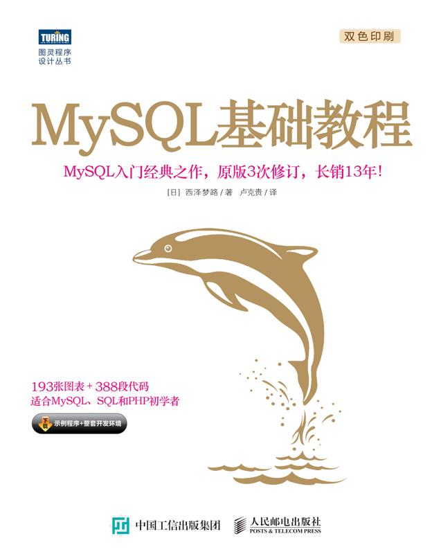</a> | <a href="https://pan.baidu.com/s/1Lj2pBOgStQwz36CzIEFlQg?pwd=y64o"> 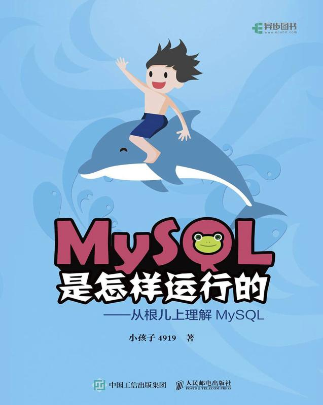</a> |  |  | <a href="https://pan.baidu.com/s/1p0IUVdou-IF4gLbs8OcVlw?pwd=yx0c"> 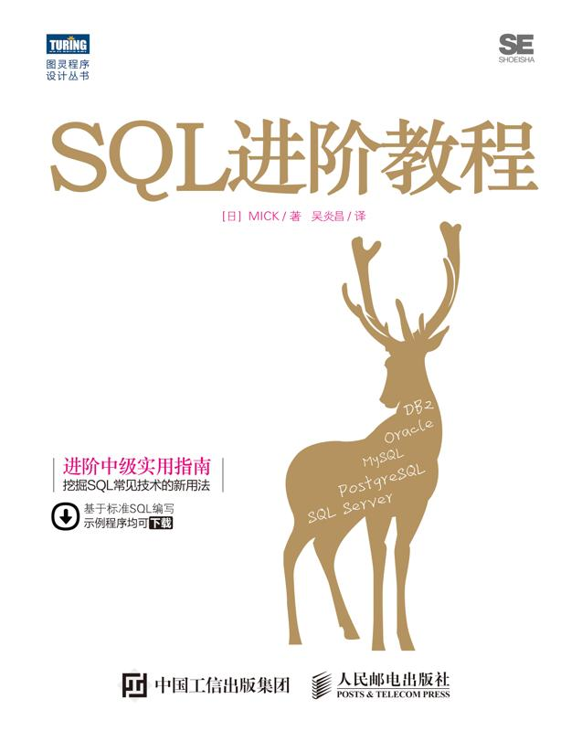</a> |
|-------------------------------------------------------------------------------------------------------------------------------|----------------------------------------------------------------------------------------------------------------------------------|------------------------------------------------------------------------------------------------------------------------------------|------------------------------------------------------------------------------------------------------------------------------------|-----------------------------------------------------------------------------------------------------------------------------|
| <a href="https://www.alipan.com/s/94p2r8kcHE6">MySQL基础教程</a>                                                                  | <a href="https://www.alipan.com/s/PFYVotq95n1">MySQL是怎样运行的</a>                                                                   | <a href="https://www.alipan.com/s/WWwYBj45uLB">SQL必知必会  (第5版)</a>                                                               | <a href="https://www.alipan.com/s/ADCEDR4QKGd">SQL基础教程 (第2版)</a>                                                                   | <a href="https://www.alipan.com/s/Q28DvXrRLyq">SQL进阶教程</a>                                                                  |

| <a href="https://pan.baidu.com/s/16A1NC40ln_NbtVEbHRjwUQ?pwd=8n0w"> 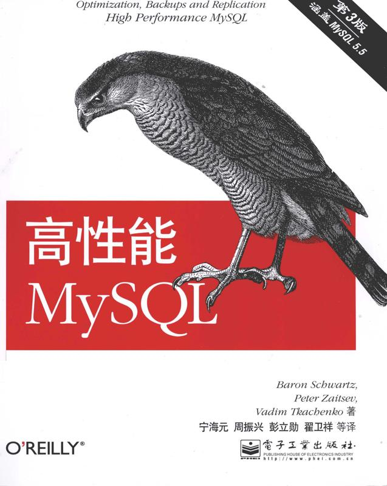</a> | <a href="https://pan.baidu.com/s/16A1NC40ln_NbtVEbHRjwUQ?pwd=8n0w"> 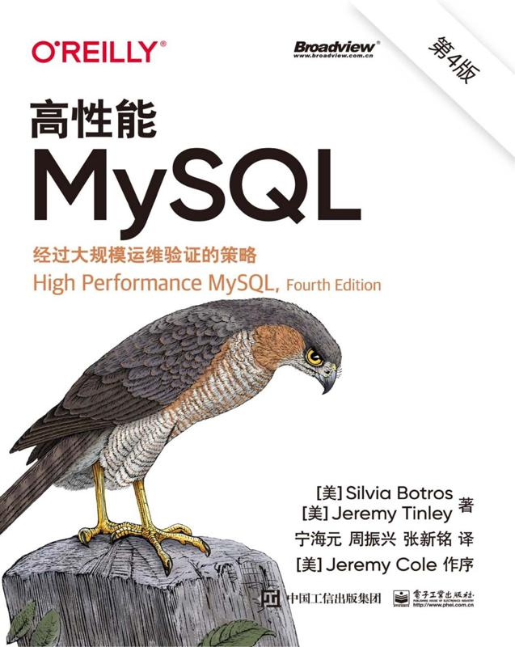</a> |  | <a href="https://pan.baidu.com/s/13iPcSKT8sRCIsSxG_WFsSA?pwd=fjmv"> 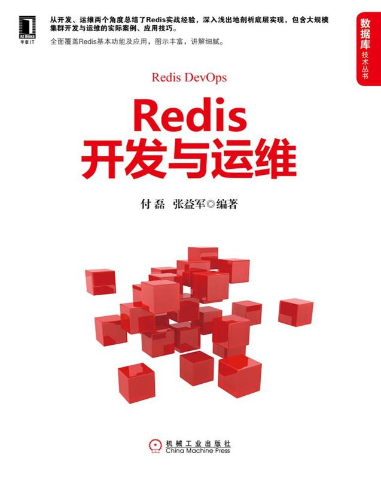</a> | <a href="https://pan.baidu.com/s/1zV1OVzWiXi3oyTDaGb66fw?pwd=84q5"> 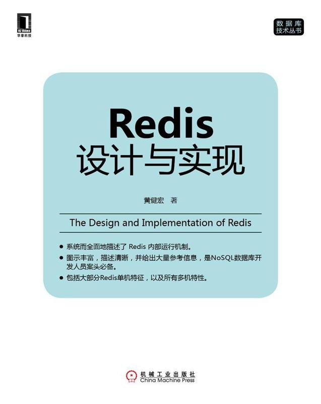</a> |
|-----------------------------------------------------------------------------------------------------------------------------------|------------------------------------------------------------------------------------------------------------------------------------|------------------------------------------------------------------------------------------------------------------------------------|---------------------------------------------------------------------------------------------------------------------------------|--------------------------------------------------------------------------------------------------------------------------------|
| <a href="https://www.alipan.com/s/WQxZqi3jRbL">高性能MYSQL （第3版)</a>                                                              | <a href="https://www.alipan.com/s/WQxZqi3jRbL">高性能MYSQL （第四版）</a>                                                               | <a href="https://www.alipan.com/s/6iuijvUVi24">数据库系统概念  (第6版)</a>                                                               | <a href="https://www.alipan.com/s/jguWCfGFQ6Y">Redis开发与运维</a>                                                                   | <a href="https://www.alipan.com/s/TC6cEzcRCxA">Redis设计与实现</a>                                                                  |

|  |  |  |  |
|---------------------------------------------------------------------------------------------------------------------------------------|---------------------------------------------------------------------------------------------------------------------------------------|-------------------------------------------------------------------------------------------------------------------------------------|-------------------------------------------------------------------------------------------------------------------------------------|
| <a href="https://www.alipan.com/s/uMgVWyqnb2R">MongoDB实战   (第2版)</a>                                                               | <a href="https://www.alipan.com/s/NwTmRoXELcd">SQL Server 从入门到精通</a>                                                               | <a href="https://www.alipan.com/s/tM5XioG9kHj">收获不止Oracle  （第2版）</a>                                                             | <a href="https://www.alipan.com/s/M8h4sCFhpi2">PostgreSQL 技术内幕</a>                                                               |

正则

|  | <a href="https://pan.baidu.com/s/1cDQnfQw6mCZmwyFODEptaQ?pwd=hhm5"> 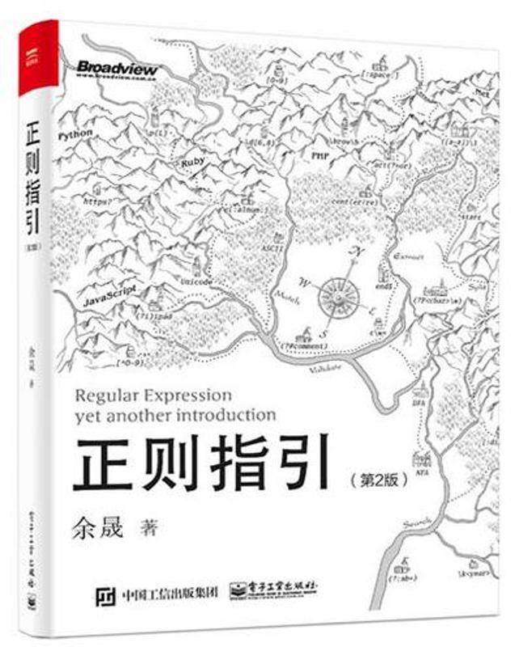</a> |
|-------------------------------------------------------------------------------------------------------------------------------------|------------------------------------------------------------------------------------------------------------------------------|
| <a href="https://www.alipan.com/s/XLYuC9UVqWD">正则表达式必知必会  (修订版)</a>                                                              | <a href="https://www.alipan.com/s/bF5fCkTtuSc">正则指引（第2版）</a>                                                                 |

Ruby

|  |
|------------------------------------------------------------------------|
| <a href="https://www.alipan.com/s/VmNVChWKzGL">Ruby元编程</a>             |

JavaScript

| <a href="https://pan.baidu.com/s/1fOWwXysrmq7hl1PQzFaLag?pwd=eehq"> 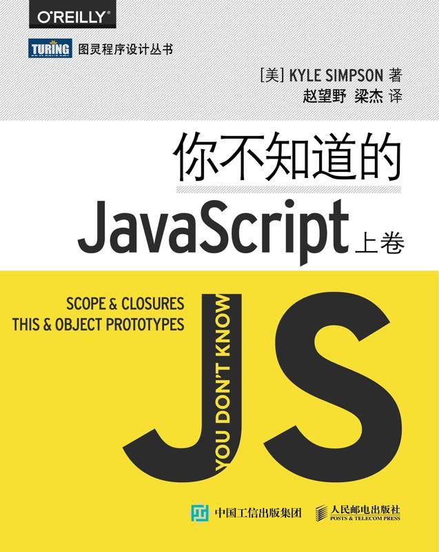</a> |  |  |  | <a href="https://pan.baidu.com/s/1e8ChuPnPDFrGKqogKwxhJg?pwd=yi3a"> 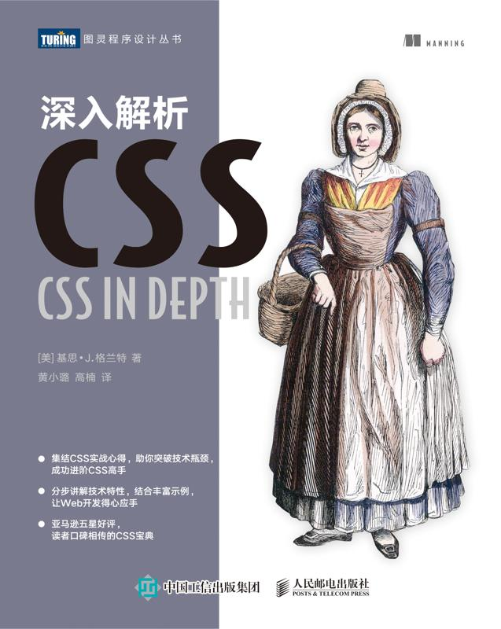</a> |
|--------------------------------------------------------------------------------------------------------------------------------------------|----------------------------------------------------------------------------------------------------------------------------------------------------|--------------------------------------------------------------------------------------------------------------------------------------------------|---------------------------------------------------------------------------------------------------------------------------------|------------------------------------------------------------------------------------------------------------------------------------|
| <a href="https://www.alipan.com/s/pNFKQADcthU">你不知道的 JavaScript</a>                                                                     | <a href="https://www.alipan.com/s/eMczR9ABeXr">JavaScript高级 程序设计 (第4版)</a>                                                                      | <a href="https://www.alipan.com/s/J3NhTx7Pa9n">JavaScript权威 指南 (第7版)</a>                                                                      | <a href="https://www.alipan.com/s/xFK2dvxwUBn">vue.js设计与实现</a>                                                                  | <a href="https://www.alipan.com/s/vYNGRwBmpec">深入解析CSS</a>                                                                         |

| <a href="https://pan.baidu.com/s/1KerYALOaiC_GYhCM0it-Mg?pwd=afje"> 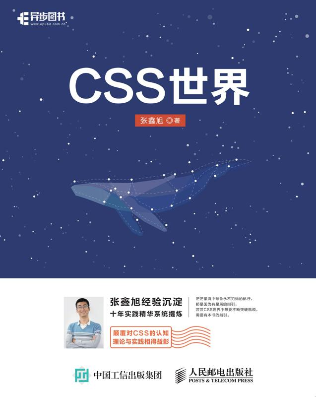</a> | <a href="https://pan.baidu.com/s/1ZoBugvbyMvAdlL8h6BIjkA?pwd=tgwt"> 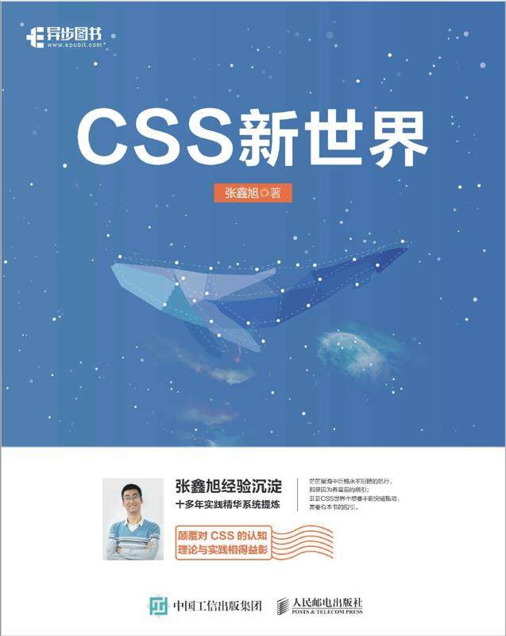</a> | <a href="https://pan.baidu.com/s/1fySZvbT5tBSJ994mqd1UJg?pwd=24d7"> 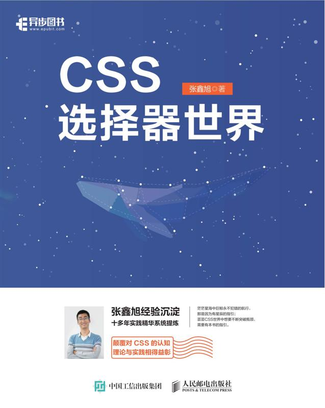</a> | <a href="https://pan.baidu.com/s/16yVIWy4bki0u3zMJN9Jsbg?pwd=bgu0"> 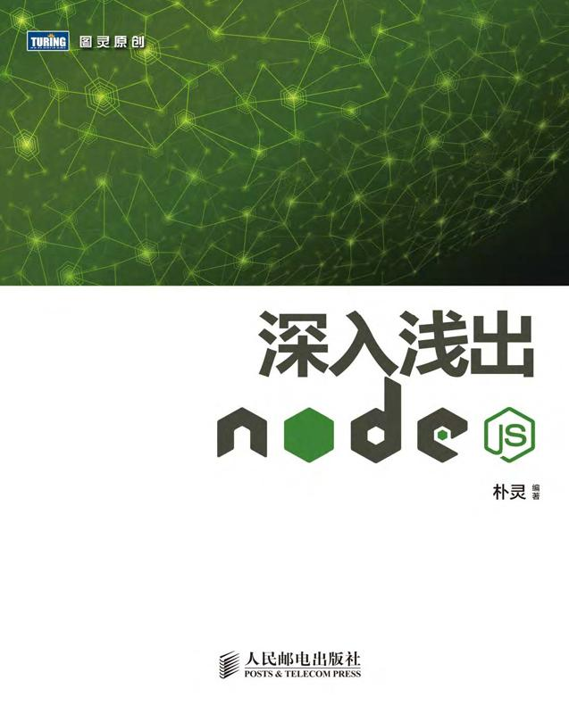</a> |  |
|----------------------------------------------------------------------------------------------------------------------------------|------------------------------------------------------------------------------------------------------------------------------------|--------------------------------------------------------------------------------------------------------------------------------------|--------------------------------------------------------------------------------------------------------------------------------------|---------------------------------------------------------------------------------------------------------------------------------------|
| <a href="https://www.alipan.com/s/eCaf8iEEJSU">CSS世界</a>                                                                         | <a href="https://www.alipan.com/s/eCaf8iEEJSU">CSS新世界</a>                                                                          | <a href="https://www.alipan.com/s/eCaf8iEEJSU">CSS选择器世界</a>                                                                          | <a href="https://www.alipan.com/s/qLtgMGKPNgV">深入浅出Node</a>                                                                          | <a href="https://www.alipan.com/s/qAqJWmaRJjZ">小程序开发原理 与实战</a>                                                                     |

| <a href="https://pan.baidu.com/s/1uiduNNHyvWyHx-ZnpfrFEw?pwd=gu12"> 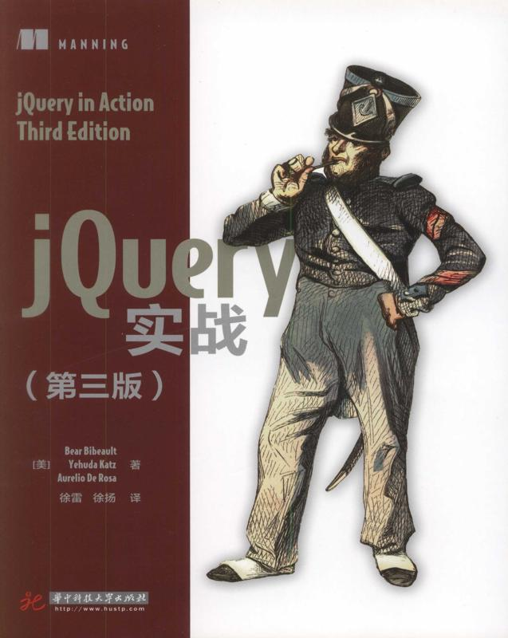</a> | <a href="https://pan.baidu.com/s/1hhJ6FuZP0dFt-DY1sAFYAw?pwd=nsh0"> 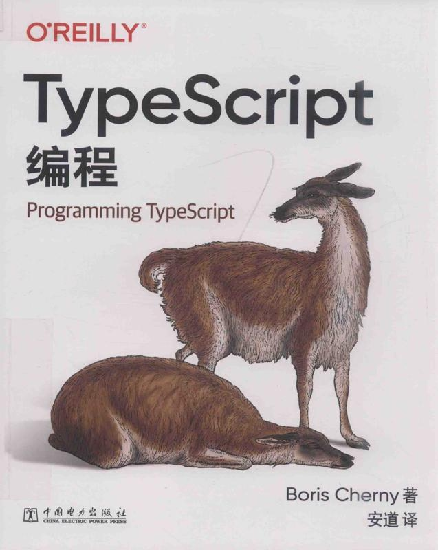</a> |  | <a href="https://pan.baidu.com/s/1wv2lCTEofI41mGxn8AeSxA?pwd=7ux1"> 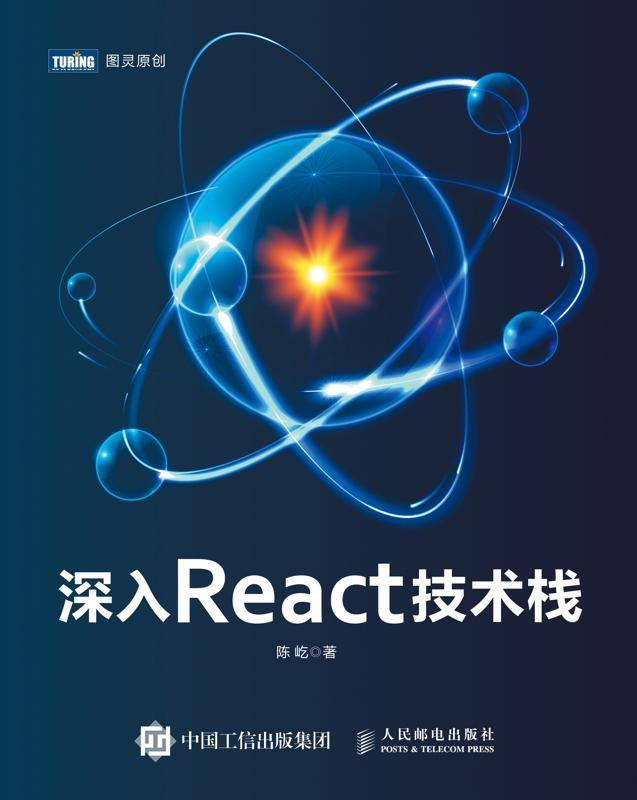</a> |  |
|------------------------------------------------------------------------------------------------------------------------------------------|------------------------------------------------------------------------------------------------------------------------------------------|--------------------------------------------------------------------------------------------------------------------------------------------|----------------------------------------------------------------------------------------------------------------------------------------|------------------------------------------------------------------------------------------------------------------------------------|
| <a href="https://www.alipan.com/s/4Jv5bJkrp5F">jQuery实战 （第三版）</a>                                                                     | <a href="https://www.alipan.com/s/XjQBfSjk3ui">TypeScript编程</a>                                                                          | <a href="https://www.alipan.com/s/gKEyBR8A38h">揭秘Angular （第2版）</a>                                                                      | <a href="https://www.alipan.com/s/JXWMXdEPmWu">深入React技术栈</a>                                                                          | <a href="https://www.alipan.com/s/4YsEECtKPsA">深入理解ES6</a>                                                                         |

Linux

|  | <a href="https://pan.baidu.com/s/1A_WQlPS_V0qK6yUnnYxvdQ?pwd=b8rx"> 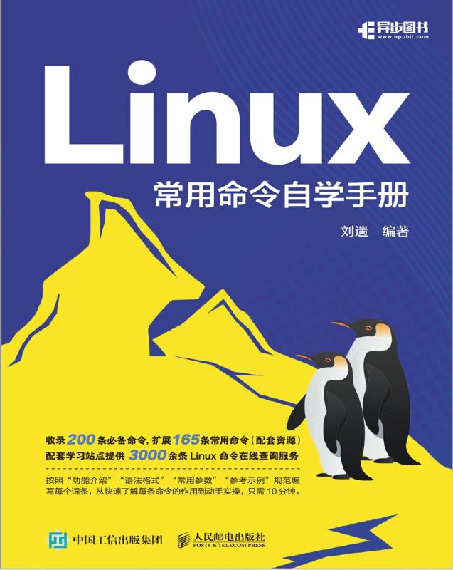</a> |  | <a href="https://pan.baidu.com/s/1qfPxmZAlf8-A_YgCtpTwtA?pwd=0yaa"> 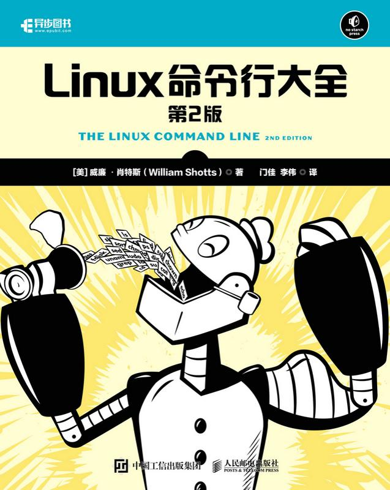</a> | <a href="https://pan.baidu.com/s/1nVjPircsOnHrkJHMGMj7_A?pwd=2ylg"> 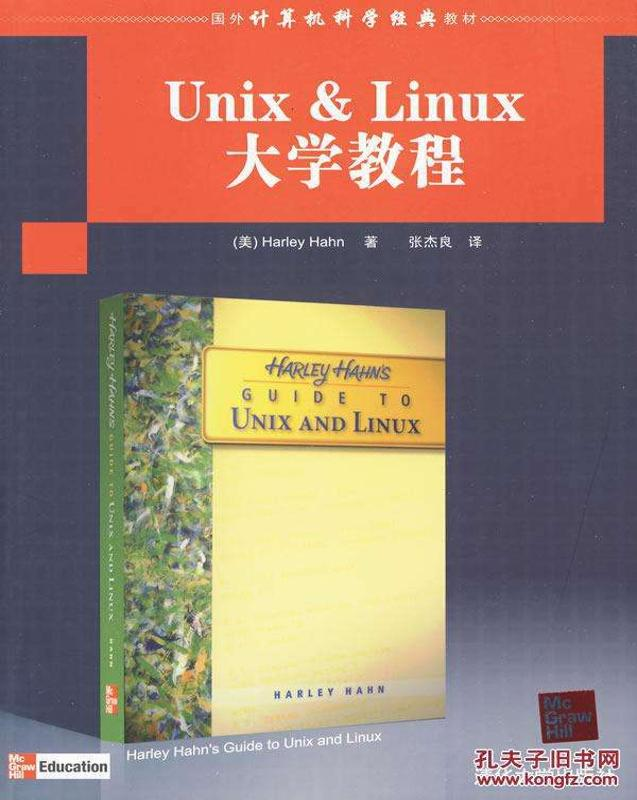</a> |
|----------------------------------------------------------------------------------------------------------------------------------------|--------------------------------------------------------------------------------------------------------------------------------------|---------------------------------------------------------------------------------------------------------------------------------------------------|----------------------------------------------------------------------------------------------------------------------------------------|--------------------------------------------------------------------------------------------------------------------------------------|
| <a href="https://www.alipan.com/s/JaFwg88SzvV">Linux UNIX 系统编程手册</a>                                                                | <a href="https://www.alipan.com/s/CmReavJBqBf">Linux常用命令 自学手册</a>                                                                 | <a href="https://www.alipan.com/s/k3XAPJUrDYs">Linux命令行与 Shell脚本编程大全 (第4版)</a>                                                              | <a href="https://www.alipan.com/s/uGsURT3w2Tg">Linux命令行大全 （第2版）</a>                                                                 | <a href="https://www.alipan.com/s/kBpczgjsNjx">Unix&Liunx 大学教程</a>                                                                |

|  | <a href=" "> 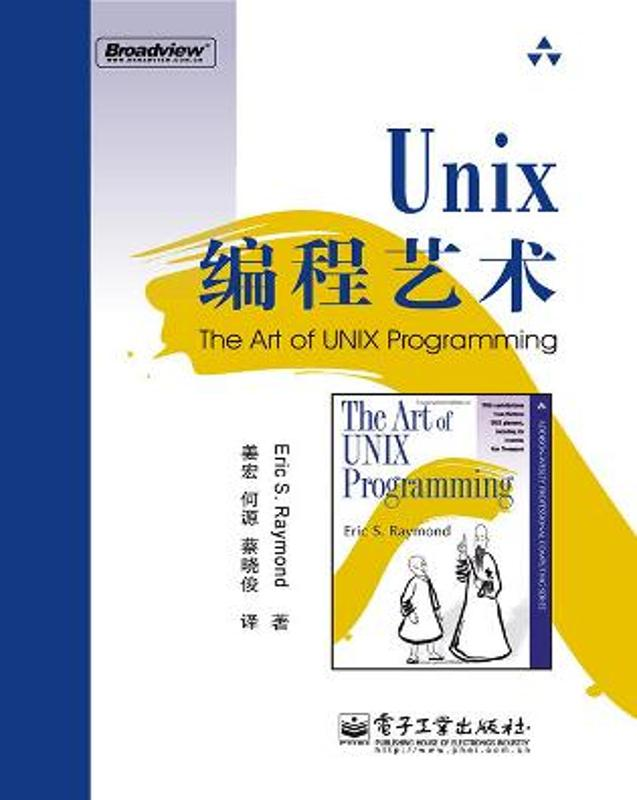</a> |  |  |  |
|---------------------------------------------------------------------------------|--------------------------------------------------------------------------|---------------------------------------------------------------------------------------------------------------------------|-----------------------------------------------------------------------------------|----------------------------------------------------------------------------|
| <a href="">UNIX环境高级编程 (第3版)</a>                                              | <a href="">UNIX编程艺术</a>                                                  | <a href="">UNIX网络编程  卷1 (第3版)</a>                                                                                      | <a href="">UNIX网络编程  卷2 (第2版)</a>                                              | <a href="">深入Linux内核架构 </a>                                                |

|  |  |  |  |  |
|-----------------------------------------------------------------------------------------------------------------------------------------|------------------------------------------------------------------------------------------------------------------------------------------|--------------------------------------------------------------------------------------------------------------------------------------|---------------------------------------------------------------------------------------------------------------------------------------------|-----------------------------------------------------------------------------------------------------------------------------------------------------------------|
| <a href="https://www.alipan.com/s/ow3V75k8bGS">鸟哥的Linux私房菜 (第3版)</a>                                                                 | <a href="https://www.alipan.com/s/ow3V75k8bGS">鸟哥的Linux私房菜 (第4版)</a>                                                                  | <a href="https://www.alipan.com/s/mvSheCYZZzQ">Vim实用技巧 (第2版)</a>                                                                  | <a href="https://www.alipan.com/s/HsGNiyfdStm">Ubuntu Linux操作 系统 微课版</a>                                                                 | <a href="https://www.alipan.com/s/MRLPhMdJnGk">Linux网络操作系统 项目教程（CentOS 7.4） （第3版）</a>                                                                     |

Latex

|  |
|---------------------------------------------------------------------------------------------------------------------------------------------|
| <a href="https://www.alipan.com/s/RV8xa3Ceadd">Latex Notes  雷太赫排版系统简介</a>                                                                |

PHP

|  |
|------------------------------------------------------------------------------|
| <a href="https://www.alipan.com/s/ta6WdNBJppy">Modern PHP   中文版</a>       |

MATLAB

| <a href="https://pan.baidu.com/s/1haOPzzwIaFnWPeiY2FuT_A?pwd=0u87"> 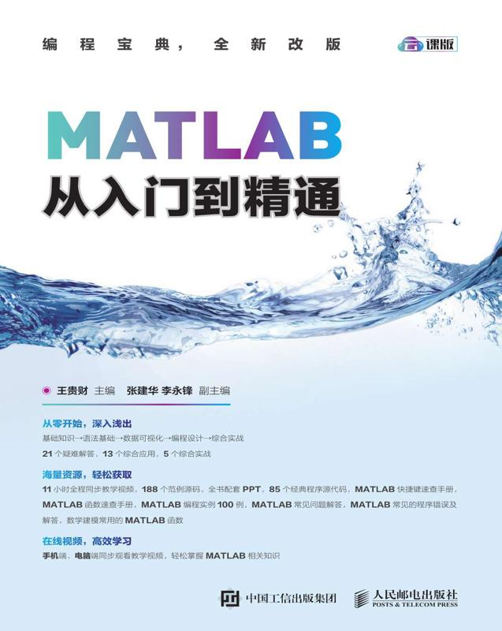</a> |
|-------------------------------------------------------------------------------------------------------------------------------------|
| <a href="https://www.alipan.com/s/pdZVW77VVmd">MATLAB从入门到精通</a>                                                                     |

Swift

| <a href="https://pan.baidu.com/s/19g8V4fVILt8G5ABbb-SEPg?pwd=xsq6"> 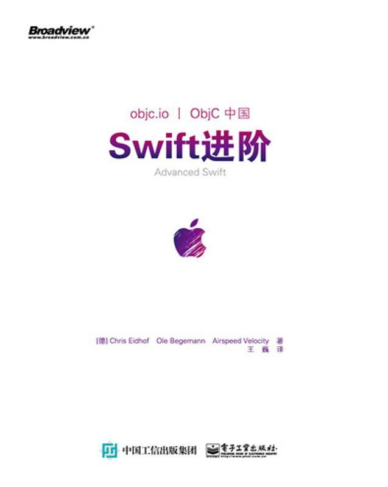</a> |
|-------------------------------------------------------------------------------------------------------------------------------|
| <a href="https://www.alipan.com/s/rE4VsNMpjrT">Swift进阶</a>                                                                    |

Kotlin

| <a href="https://pan.baidu.com/s/1QsbBn6Qd6tgjEjtCj45OSw?pwd=fg42"> 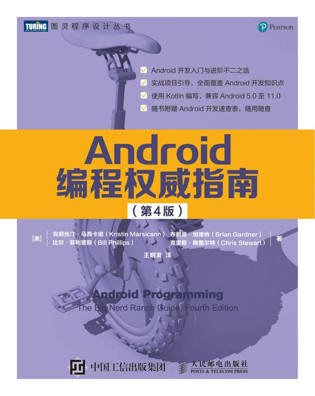</a> |  |
|--------------------------------------------------------------------------------------------------------------------------------------|---------------------------------------------------------------------------------------------------------------------------------|
| <a href="https://www.alipan.com/s/iArr3njFhHQ">Android编程 权威指南</a>                                                                 | <a href="https://www.alipan.com/s/5LdsCwj8uEq">kotlin实战</a>                                                                     |

# 软件工程

产品经理

架构设计

|  | <a href="https://pan.baidu.com/s/1vcFWdvWFarIT2Ns9HH7CJg?pwd=ndtn"> 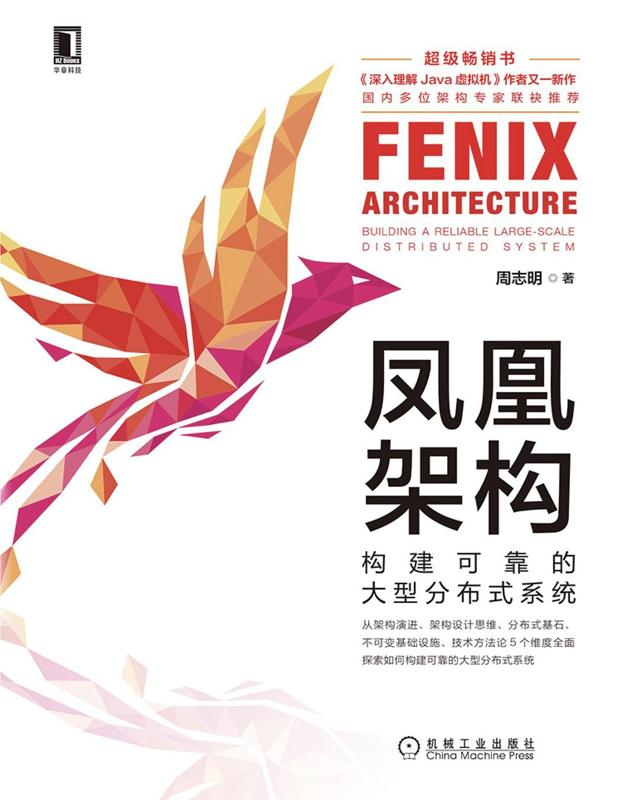</a> | <a href="https://pan.baidu.com/s/1az1uK2tSq6UXJCqEZKmvnQ?pwd=7ldz"> 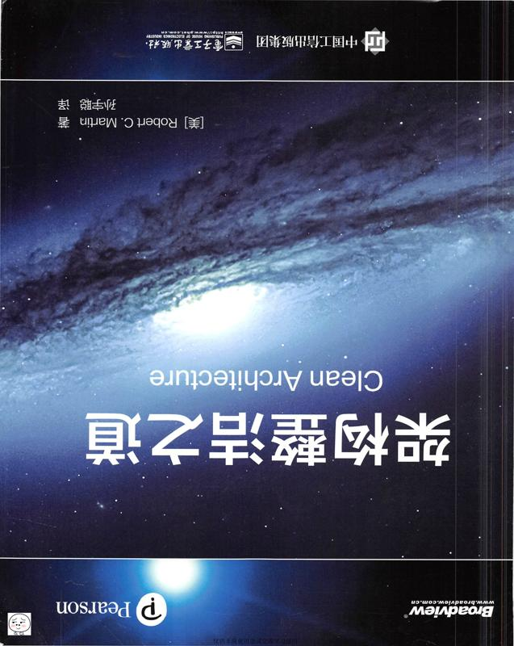</a> |  |  |
|-----------------------------------------------------------------------------------------------------------------------------|----------------------------------------------------------------------------------------------------------------------------|------------------------------------------------------------------------------------------------------------------------------|----------------------------------------------------------------------------------------------------------------------------------------------|-------------------------------------------------------------------------------------------------------------------------------------------|
| <a href="https://www.alipan.com/s/MEd2Qc24jcP">大话设计模式</a>                                                                   | <a href="https://www.alipan.com/s/pYfEn4LiRWs">凤凰架构</a>                                                                    | <a href="https://www.alipan.com/s/85ZctHuVBdk">架构整洁之道</a>                                                                    | <a href="https://www.alipan.com/s/jngzpWiyxu3">设计模式 可复用 面向对象软件的 基础（典藏版）</a>                                                            | <a href="https://www.alipan.com/s/TmXb9SUf4wi">设计模式的艺术 软件开发人员内功 修炼之道</a>                                                            |

|  | <a href="https://pan.baidu.com/s/1XZ5wvUVb05x_N6MvaJjtFw?pwd=fq2h"> 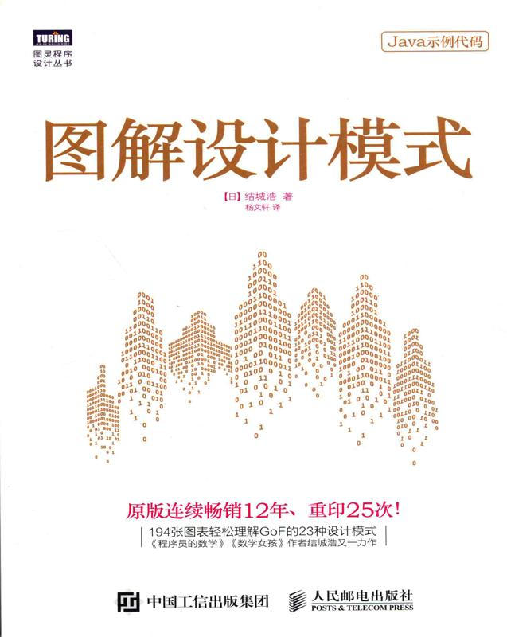</a> | <a href="https://pan.baidu.com/s/1EAaJyRFloBOm4wNfh_vEUQ?pwd=q3l3"> 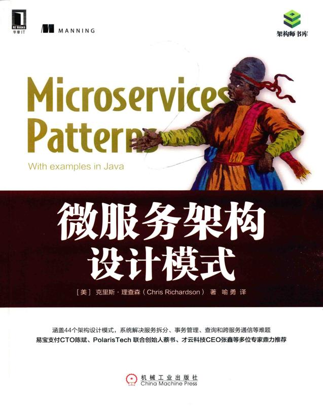</a> |  | <a href="https://pan.baidu.com/s/182P5QjV1IgVw13JJyE-lqw?pwd=didl"> 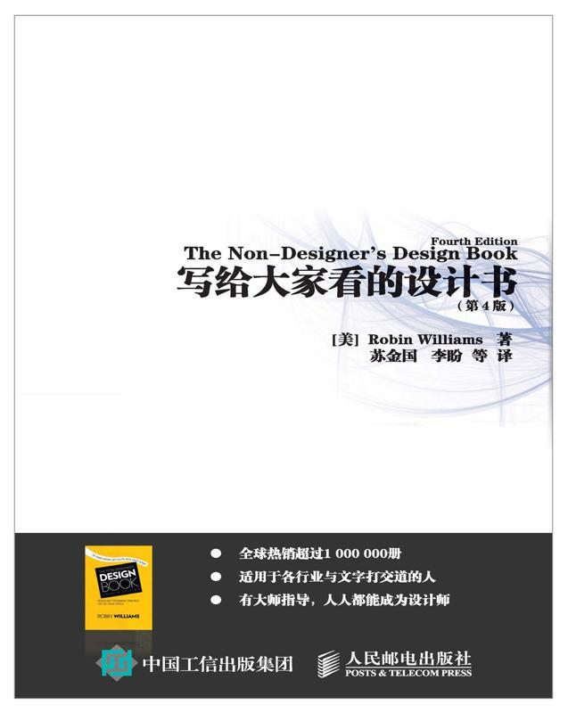</a> |
|------------------------------------------------------------------------------------------------------------------------------|------------------------------------------------------------------------------------------------------------------------------|--------------------------------------------------------------------------------------------------------------------------------|----------------------------------------------------------------------------------------------------------------------------------|-----------------------------------------------------------------------------------------------------------------------------------------|
| <a href="https://www.alipan.com/s/wKHDW7P83tb">设计模式之美</a>                                                                    | <a href="https://www.alipan.com/s/HqjwXvUiz3o">图解设计模式</a>                                                                    | <a href="https://www.alipan.com/s/Nz5rxjE7vok">微服务架构设计模式</a>                                                                   | <a href="https://www.alipan.com/s/m2SaRdMHGbW">软件工程 （第10版）</a>                                                                | <a href="https://www.alipan.com/s/yb5QrB2Q3wp">写给大家看的设计书 （第4版）</a>                                                                   |

|  |  |
|----------------------------------------------------------------------------------------------------------------------------------|--------------------------------------------------------------------------------------------------------------------------------|
| <a href="https://www.alipan.com/s/Uq6AXQzrYXJ">游戏引擎架构 （第2版）</a>                                                               | <a href="https://www.alipan.com/s/dMvPB9qYt5W">代码随想录 八股文(第四版)</a>                                                           |

测试运维

|  | <a href="https://pan.baidu.com/s/1QQJg8D8GYhBnniF2_aMTxg?pwd=12vg"> 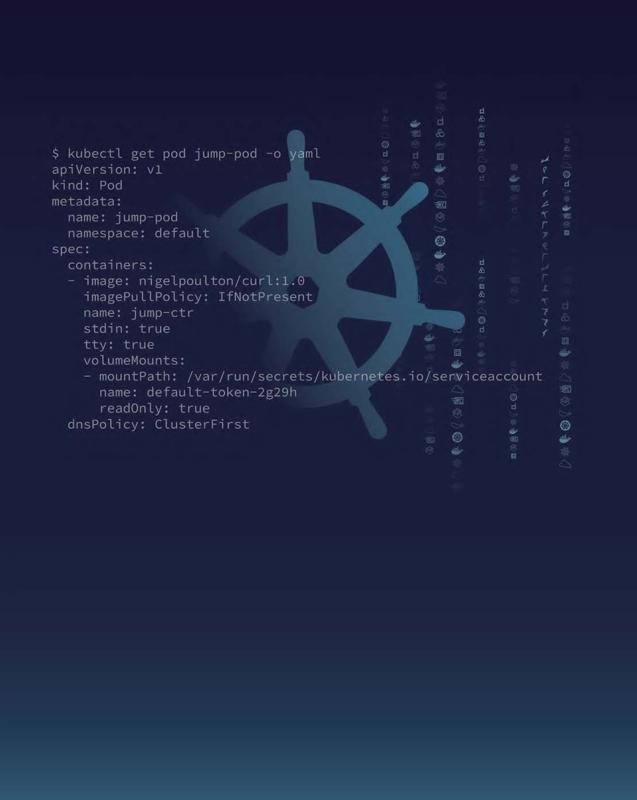</a> | <a href="https://pan.baidu.com/s/1mfXSvmaKOix24gEOMduKxw?pwd=81fu"> 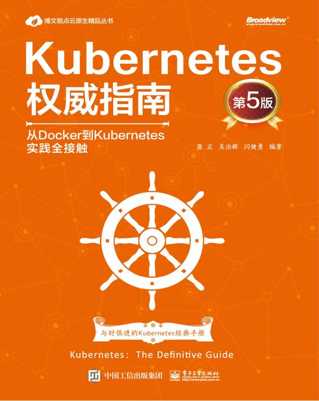</a> | <a href="https://pan.baidu.com/s/1meZM_zK_faecK6ZPOzcL1g?pwd=ll98"> 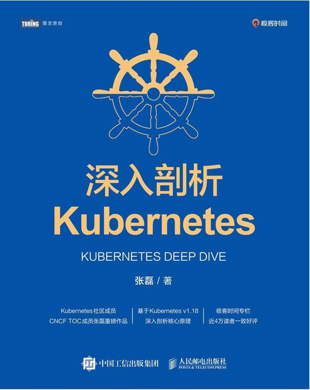</a> | <a href="https://pan.baidu.com/s/1i9GubQdNbt1Wno6GohYYmA?pwd=ku0t"> 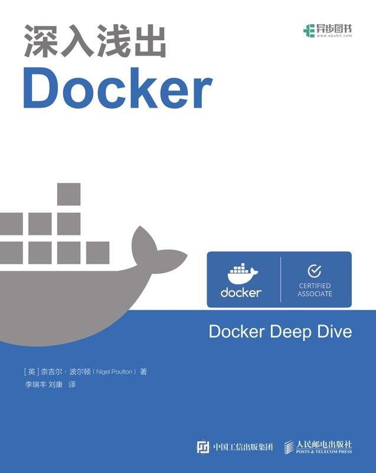</a> |
|----------------------------------------------------------------------------------------------------------------------------------------|-------------------------------------------------------------------------------------------------------------------------------------|-----------------------------------------------------------------------------------------------------------------------------------|-------------------------------------------------------------------------------------------------------------------------------------|--------------------------------------------------------------------------------------------------------------------------------|
| <a href="https://www.alipan.com/s/SDBVQyqEaPg">Docker 容器与 容器云（第2版）</a>                                                              | <a href="https://www.alipan.com/s/TZaReE5JwhZ">Kubernetes修炼手册</a>                                                                   | <a href="https://www.alipan.com/s/V1h65SMyN1e">kubernet权威指南</a>                                                                   | <a href="https://www.alipan.com/s/JGARy9z695M">深入剖析Kubernetes</a>                                                                   | <a href="https://www.alipan.com/s/6FPJNnkPczt">深入浅出Docker</a>                                                                  |

| <a href="https://pan.baidu.com/s/1BV9GmdyF7KpkZtKxIUUAeg?pwd=r4dw"> 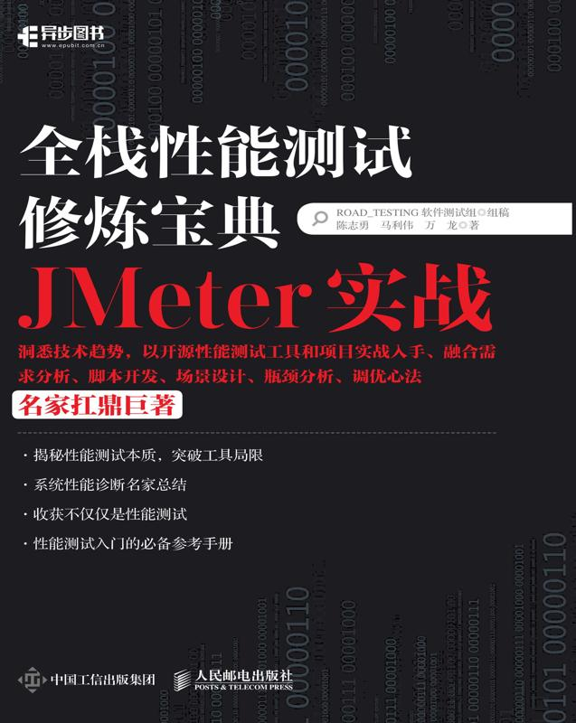</a> | <a href="https://pan.baidu.com/s/1_QDiQRdpVSDV96J_RequoA?pwd=46xa"> 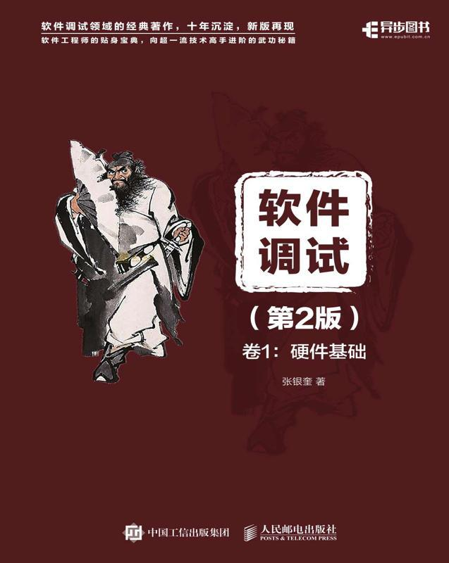</a> | <a href="https://pan.baidu.com/s/1ZXXf3TGNkLZszNXj0tiI6w?pwd=93e0"> 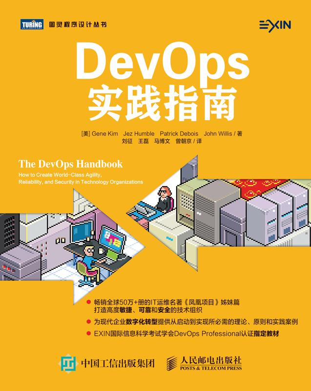</a> |  |
|-----------------------------------------------------------------------------------------------------------------------------------------|---------------------------------------------------------------------------------------------------------------------------|--------------------------------------------------------------------------------------------------------------------------------|---------------------------------------------------------------------------------------------------------------------------------------|
| <a href="https://www.alipan.com/s/ymVr8sbixrd">全栈性能测试修炼 宝典 JMeter实战</a>                                                              | <a href="https://www.alipan.com/s/6jEbT2ReJ2T">软件调试  (第二版)</a>                                                         | <a href="https://www.alipan.com/s/tcVqqR5eAgk">DevOps实践指南</a>                                                                  | <a href="https://www.alipan.com/s/U8Gg6TtdSGr">持续交付  发布可 靠软件的系统方法</a>                                                              |

# 数学基础

应用数学

|  |  |  | <a href="https://pan.baidu.com/s/10wBW0x3HtYh9Ho4iw-HUOQ?pwd=2d05"> 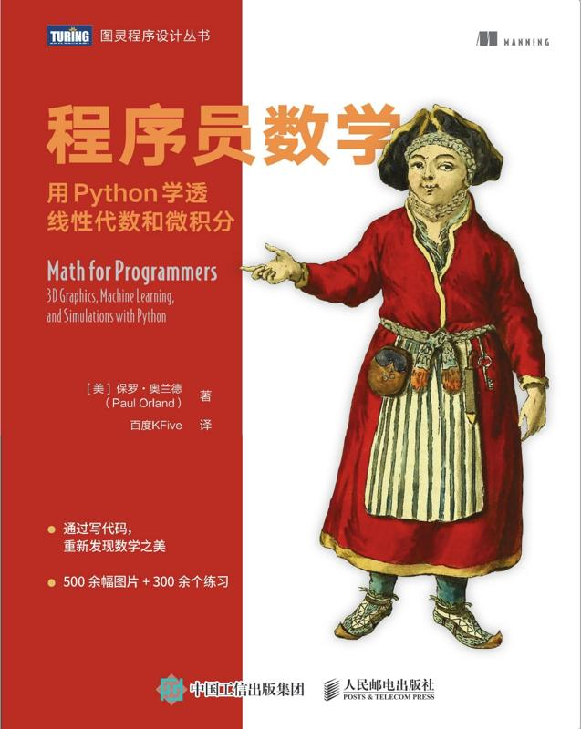</a> | <a href="https://pan.baidu.com/s/1xzSmjnh26gVAlff_omGsQw?pwd=stqb"> 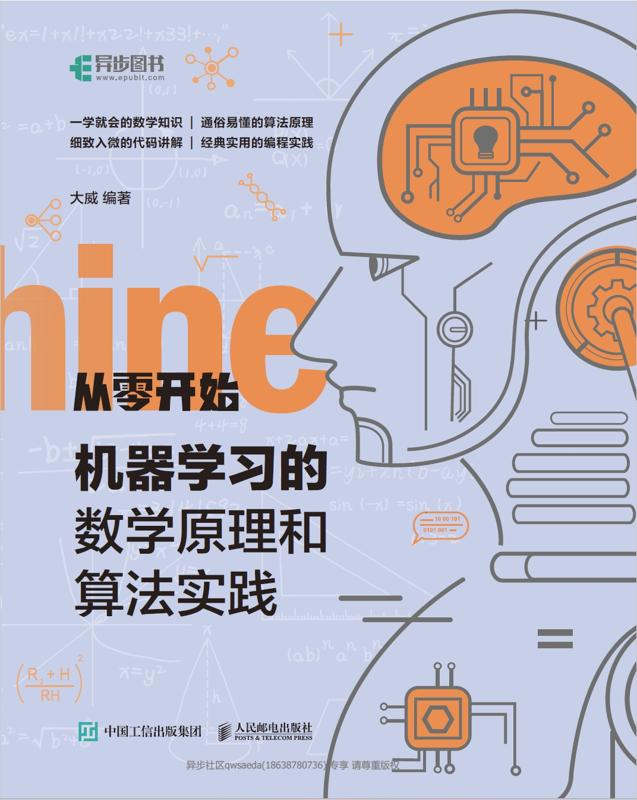</a> |
|-----------------------------------------------------------------------------------------------------------------------------------|-------------------------------------------------------------------------------------------------------------------------------------|-------------------------------------------------------------------------------------------------------------------------------------|-----------------------------------------------------------------------------------------------------------------------------|------------------------------------------------------------------------------------------------------------------------------------------|
| <a href="https://www.alipan.com/s/7dacdhWPhhq">程序员的数学  (第2版)</a>                                                               | <a href="https://www.alipan.com/s/7dacdhWPhhq">程序员的数学  2 概率统计</a>                                                                | <a href="https://www.alipan.com/s/7dacdhWPhhq">程序员的数学  3 线性代数</a>                                                                | <a href="https://www.alipan.com/s/Tp9md9tsShp">程序员数学</a>                                                                    | <a href="https://www.alipan.com/s/bzAzv7tGHAH">从零开始 机器学习 的数学原理和算法实践</a>                                                               |

|  | <a href="https://pan.baidu.com/s/10v6w7_Zyo3UupbuJcRSgmA?pwd=r4g1"> 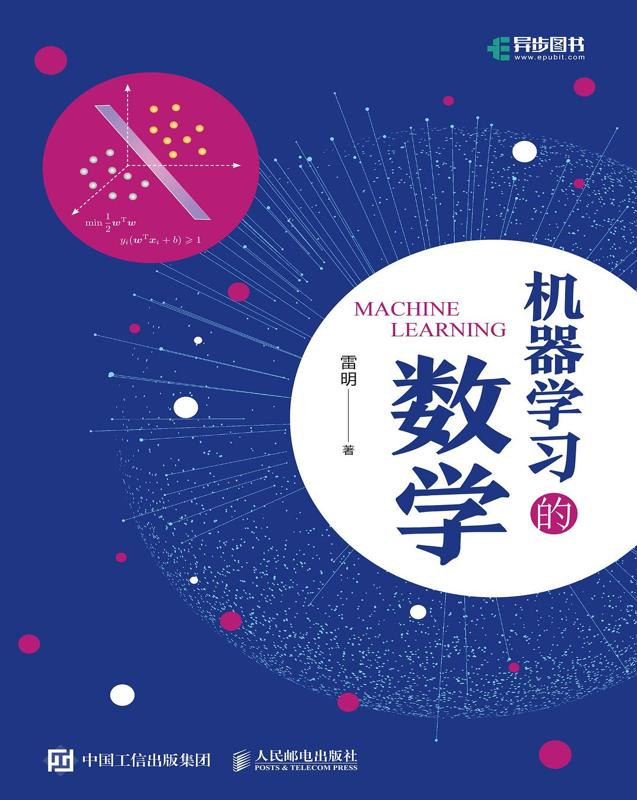</a> | <a href="https://pan.baidu.com/s/1qy5XMIL0K0YffIoFfVAmbA?pwd=02nr"> 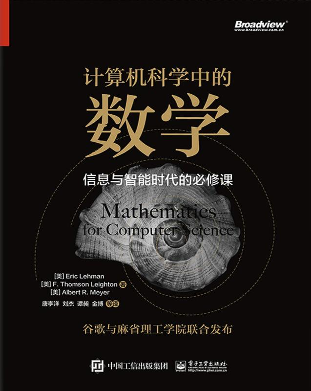</a> |  | <a href="https://pan.baidu.com/s/1S0hkuJwe3J6X7SRa3IPLFQ?pwd=d2vc"> 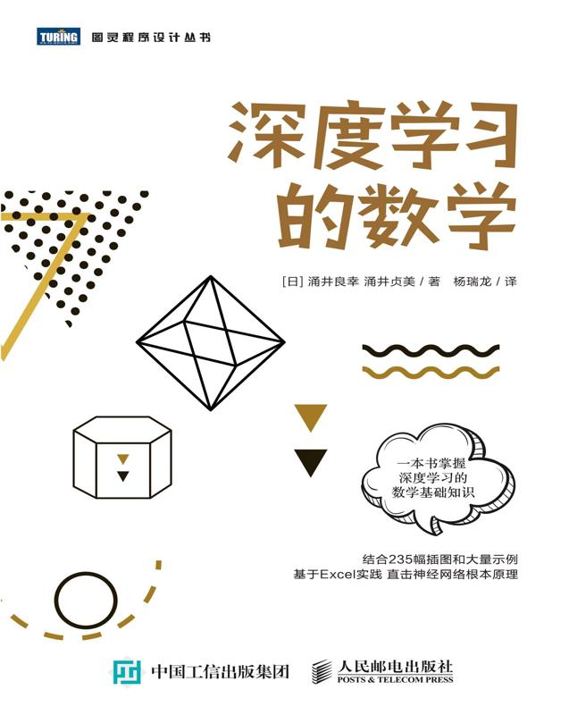</a> |
|---------------------------------------------------------------------------------------------------------------------------------|-------------------------------------------------------------------------------------------------------------------------------|---------------------------------------------------------------------------------------------------------------------------------------------|------------------------------------------------------------------------------------------------------------------------------------------|------------------------------------------------------------------------------------------------------------------------------|
| <a href="https://www.alipan.com/s/xF5aZMhgM3M">改变世界的17个方程</a>                                                                   | <a href="https://www.alipan.com/s/keF2QT7jhEi">机器学习的数学</a>                                                                    | <a href="https://www.alipan.com/s/4YqtY7qabAE">计算机科学中的数学</a>                                                                                | <a href="https://www.alipan.com/s/CZ64HP3t88V">具体数学 计算机科学基础  (第2版)</a>                                                             | <a href="https://www.alipan.com/s/veSEi9TLkuW">深度学习的数学</a>                                                                   |

|  |  |  |
|---------------------------------------------------------------------------------------------------------------------------------|------------------------------------------------------------------------------------------------------------------------------------|--------------------------------------------------------------------------------------------------------------------------------|
| <a href="https://www.alipan.com/s/RbwHDGtCB6k">数学之美（第三版）</a>                                                                    | <a href="https://www.alipan.com/s/SY6LcZwCM1q">统计学习方法  (第2版)</a>                                                                | <a href="https://www.alipan.com/s/RNUjKy6u83B">吴军数学通识讲义</a>                                                                    |

高等数学

|  |  |  |  |  |
|----------------------------------------------------------------------------------------------------------------------------------|---------------------------------------------------------------------------------------------------------------------------------|----------------------------------------------------------------------------------------------------------------------------------|--------------------------------------------------------------------------------------------------------------------------------------|--------------------------------------------------------------------------------------------------------------------------------------|
| <a href="https://www.alipan.com/s/yS7jAx6GGe3">纯数学教程  (第9版)</a>                                                               | <a href="https://www.alipan.com/s/wWVDbDd93uY">复分析 可视化方法</a>                                                                 | <a href="https://www.alipan.com/s/6wT66a4rmDx">概率导论 (第2版)</a>                                                                    | <a href="https://www.alipan.com/s/6FFk14GXV6b">线性代数及其应用  (第4版)</a>                                                                | <a href="">线性代数应该这样学  (第3版)</a>                                                                                                   |

| <a href="https://pan.baidu.com/s/1jicSvhpjjV74uH5vjCkQhw?pwd=83e6"> 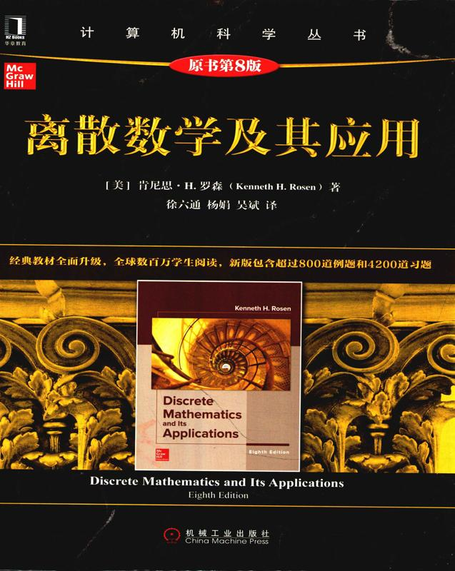</a> |  |  |  |  |
|--------------------------------------------------------------------------------------------------------------------------------------|----------------------------------------------------------------------------------------------------------------------------------|---------------------------------------------------------------------------------------------------------------------------------|----------------------------------------------------------------------------------------------------------------------------------|--------------------------------------------------------------------------------------------------------------------------------------|
| <a href="https://www.alipan.com/s/FqsNFX9NgXr">离散数学及其应用 （原书第8版）</a>                                                               | <a href="https://www.alipan.com/s/qVbx5oXjZoJ">组合数学 (第5版)</a>                                                                    | <a href="https://www.alipan.com/s/hrBMnDK1oDE">普林斯顿概率论 读本</a>                                                                | <a href="https://www.alipan.com/s/F7F5ezhonqk">普林斯顿数学分析 读本</a>                                                                | <a href="">普林斯顿微积分 读本 (修订版)</a>                                                                                                   |

# 大数据

数据分析

| <a href="https://pan.baidu.com/s/17iaLpwaY_lh3sAm1tP97rw?pwd=sl0h"> 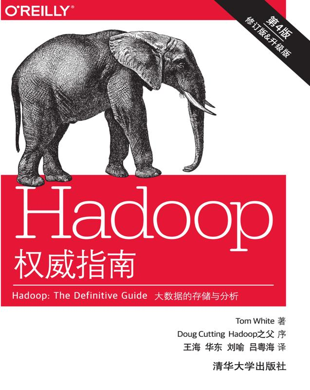</a> | <a href="https://pan.baidu.com/s/1CWXkxEqemnxrWAHLanaAAQ?pwd=dttc"> 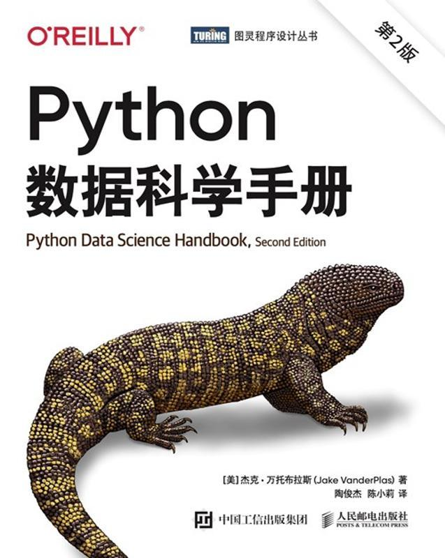</a> |  |  |
|----------------------------------------------------------------------------------------------------------------------------------|------------------------------------------------------------------------------------------------------------------------------------|-------------------------------------------------------------------------------------------------------------------------------------------|------------------------------------------------------------------------------------------------------------------------------------------|
| <a href="https://www.alipan.com/s/VheWhvJQLSz">Hadoop权威指南</a>                                                                    | <a href="https://www.alipan.com/s/bXmh7cwNwRx">Python数据科学手册</a>                                                                    | <a href="https://www.alipan.com/s/72Vz24Nxr19">利用Python进行数 据分析 第2版</a>                                                                 | <a href="https://www.alipan.com/s/cVePKPMsWtY">Python金融大数 据分析 (第2版)</a>                                                               |

数据挖掘

| <a href="https://pan.baidu.com/s/1zwpxNtSfSCZB8hnGQqsQxQ?pwd=gl97"> 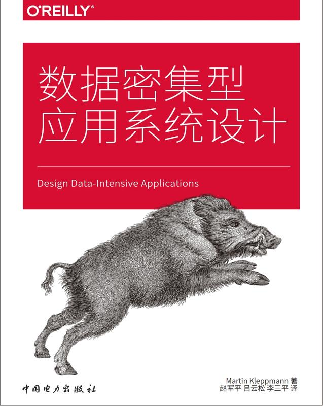</a> |  |  |
|-----------------------------------------------------------------------------------------------------------------------------------|----------------------------------------------------------------------------------------------------------------------------------------|-----------------------------------------------------------------------------------------------------------------------------------|
| <a href="https://www.alipan.com/s/P9LKs844U4a">数据密集型 应用系统设计</a>                                                                | <a href="https://www.alipan.com/s/MrJ6MCzcWzX">数据挖掘 概念与 技术 (第3版)</a>                                                                | <a href="https://www.alipan.com/s/zg44Fspnawr">数据挖掘导论  (完整版)</a>                                                               |

# 人工智能

机器学习

| <a href="https://pan.baidu.com/s/1_sR-rO7d-Ngf-hwdGGr0Bg?pwd=u6ze"> 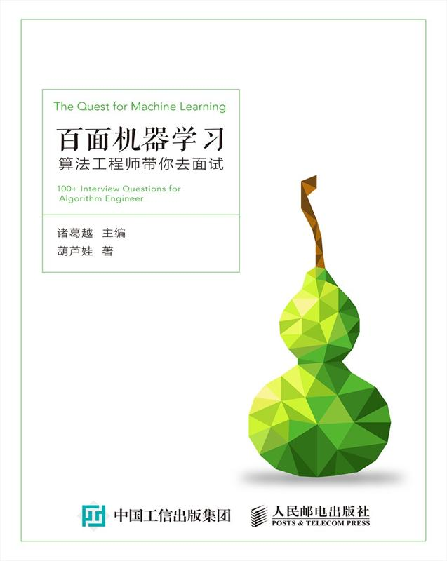</a> | <a href="https://pan.baidu.com/s/15rtNg9bl6AOpHdVPPNaDvA?pwd=245y"> 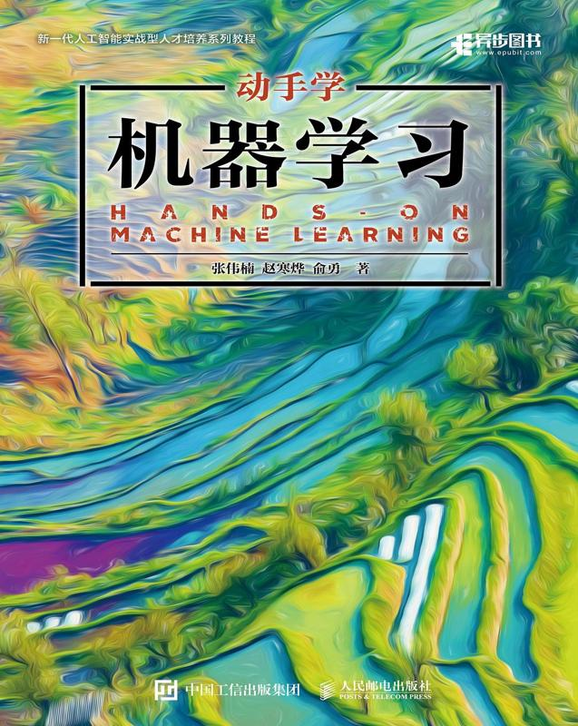</a> |  |  |  |
|-----------------------------------------------------------------------------------------------------------------------------|-------------------------------------------------------------------------------------------------------------------------------|----------------------------------------------------------------------------------------------------------------------------------|--------------------------------------------------------------------------------------------------------------------------------------|---------------------------------------------------------------------------------------------------------------------------|
| <a href="https://www.alipan.com/s/eFS7SKPPCVn">百面机器学习</a>                                                                   | <a href="https://www.alipan.com/s/5o7KPjPDWjG">动手学机器学习</a>                                                                    | <a href="https://www.alipan.com/s/vPkpFaAy63y">机器学习 (第2版)</a>                                                                    | <a href="https://www.alipan.com/s/SgD7PhrL51P">机器学习 公式 推导与代码实现</a>                                                                | <a href="https://www.alipan.com/s/qkDKCuwMviB">机器学习</a>                                                                   |

|  | <a href="https://pan.baidu.com/s/1czrDHf8rpCQpjHtaSLAsaA?pwd=xvyz"> 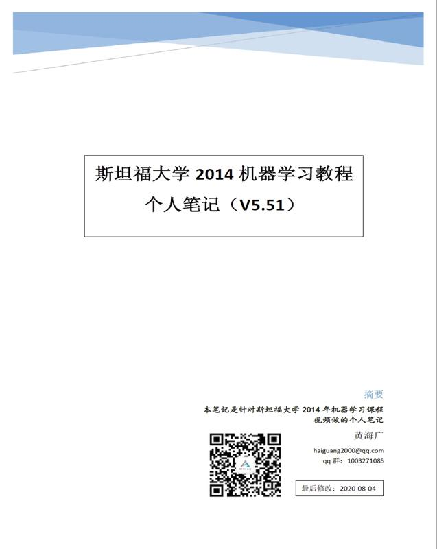</a> |  |  | <a href="https://pan.baidu.com/s/1_KxEfndEdFW770_j750oMA?pwd=viwo"> 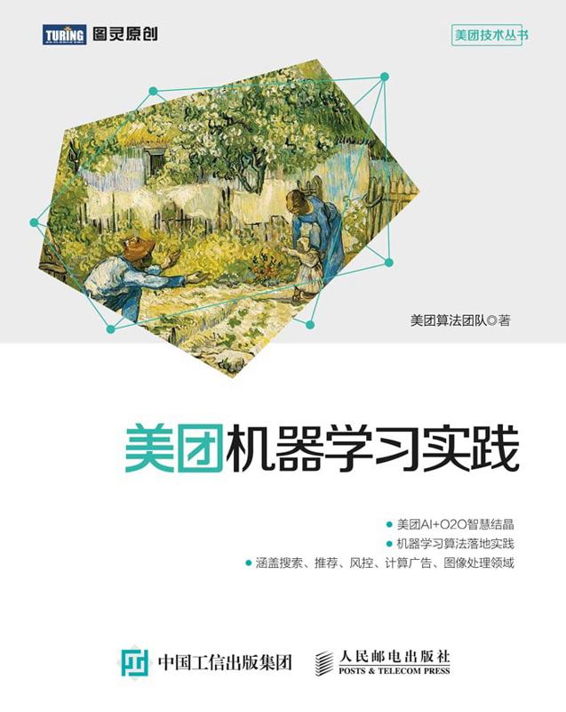</a> |
|-----------------------------------------------------------------------------------------------------------------------------------|----------------------------------------------------------------------------------------------------------------------------------------|--------------------------------------------------------------------------------------------------------------------------------|--------------------------------------------------------------------------------------------------------------------------------------------------------------------|-------------------------------------------------------------------------------------------------------------------------------|
| <a href="https://www.alipan.com/s/FaXkPDu6iCt">机器学习Python实战</a>                                                                   | <a href="https://www.alipan.com/s/dggQvN5xoTa">机器学习笔记 (吴恩达) v5.51</a>                                                            | <a href="https://www.alipan.com/s/evrrhQgY6eV">机器学习公式详解</a>                                                                    | <a href="https://www.alipan.com/s/5gB7o8XSNjs">机器学习实战 基于Scikit-Learn、 Keras和TensorFlow  (第2版)                                                             | <a href="https://www.alipan.com/s/VhK96ZDT7pm">美团机器学习实践</a>                                                                   |

| <a href="https://pan.baidu.com/s/1JttiPd7j-C5vQgwb1jJSZg?pwd=ttv2"> 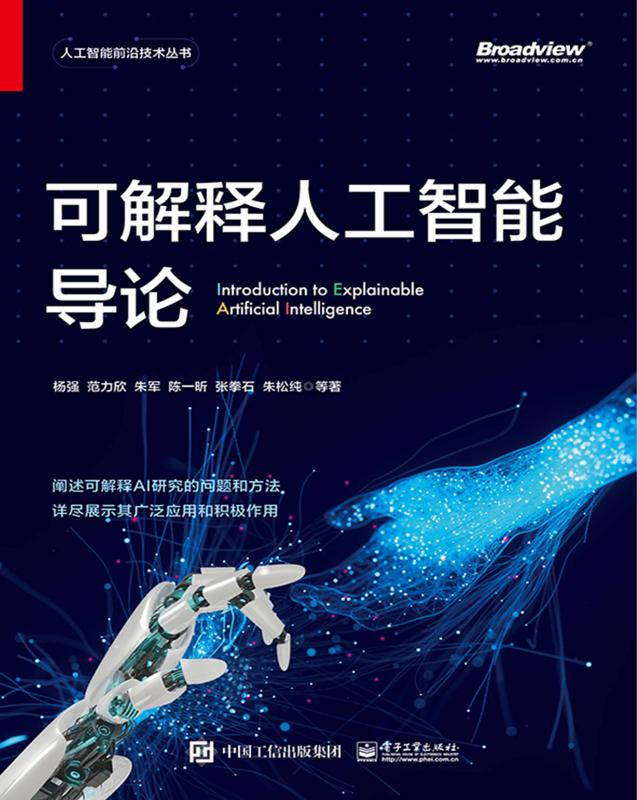</a> | <a href="https://pan.baidu.com/s/1_ZGQEjdNjB_w7ZKuUU6Pfw?pwd=39sz"> 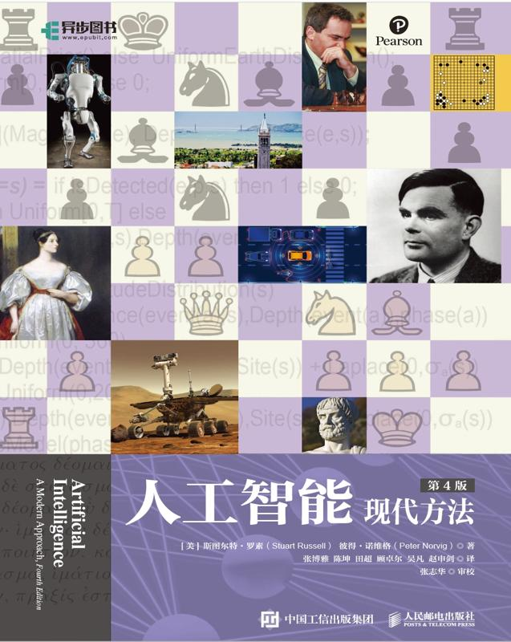</a> |  |  | <a href="https://pan.baidu.com/s/1SocDzqv2VoRaM5fzaDiY8Q?pwd=6sss"> 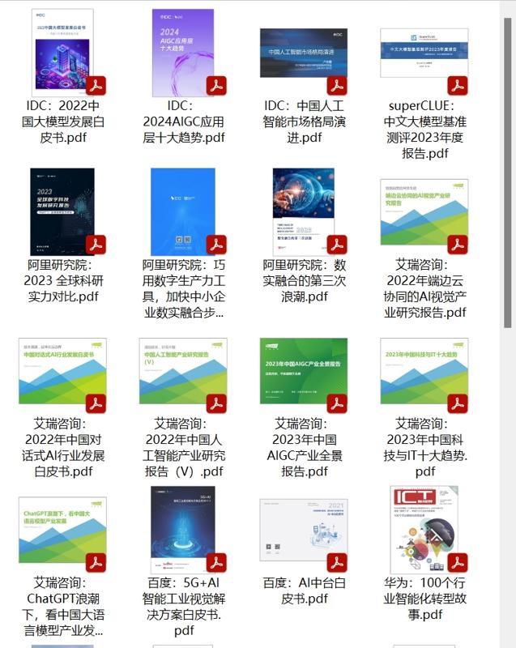</a> |
|---------------------------------------------------------------------------------------------------------------------------------|--------------------------------------------------------------------------------------------------------------------------------------|------------------------------------------------------------------------------------------------------------------------------|---------------------------------------------------------------------------------------------------------------------------|---------------------------------------------------------------------------------------------------------------------------------|
| <a href="https://www.alipan.com/s/NLQcpbUjyQc">可解释人工智能 导论</a>                                                                | <a href="https://www.alipan.com/s/w3horP8dXe4">人工智能 现代方法（第4版）</a>                                                                 | <a href="https://www.alipan.com/s/xwes2bHtwMX">实用推荐系统</a>                                                                    | <a href="https://www.alipan.com/s/VsqmyEXuR3C">鸢尾花书</a>                                                                   | <a href="">AI行业报告2023</a>                                                                                                       |

深度学习

| <a href="https://pan.baidu.com/s/1XiKBap13cjAJAOi3FKwsmw?pwd=034e"> 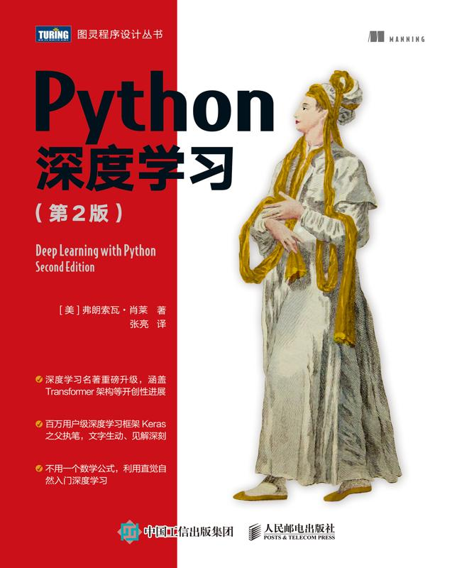</a> |  |  |  |  |
|--------------------------------------------------------------------------------------------------------------------------------------|--------------------------------------------------------------------------------------------------------------------------------------|-------------------------------------------------------------------------------------------------------------------------------------|---------------------------------------------------------------------------------------------------------------------------------|---------------------------------------------------------------------------------------------------------------------------------------------|
| <a href="https://www.alipan.com/s/k8jxXQBMpZr">Python深度学习 （第2版）</a>                                                               | <a href="https://www.alipan.com/s/VpZBKaN6UNN">Pytorch 深度学习实战</a>                                                                    | <a href="https://www.alipan.com/s/GebdTJPfccv">动手学深度学习  (第2版)</a>                                                                | <a href="https://www.alipan.com/s/pYJHELMSCFs">深度学习500问</a>                                                                     | <a href="https://www.alipan.com/s/xq6LE8txE7Q">深度学习原理与 pytorch实战  (第2版)</a>                                                           |

| <a href="https://pan.baidu.com/s/1ioU_mW-_g5iw4azTPz2Cvg?pwd=hyz8"> 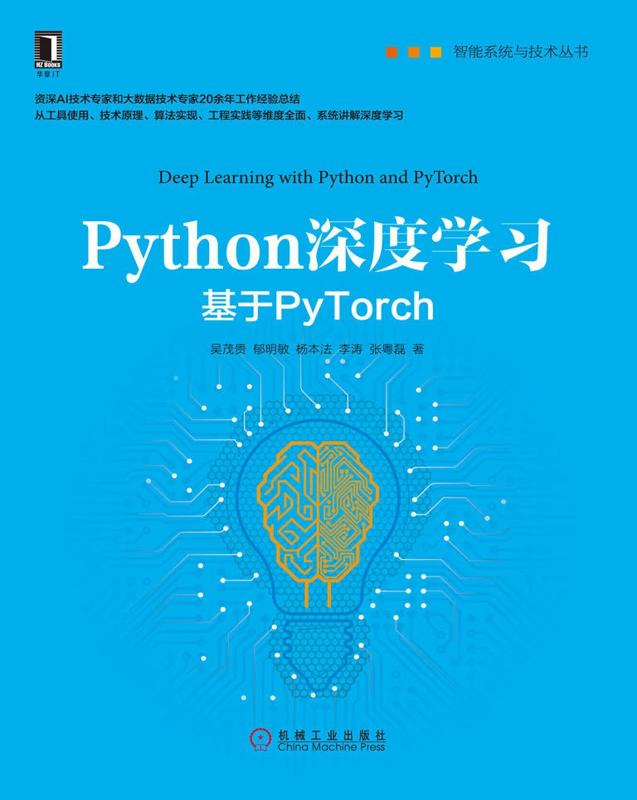</a> | <a href="https://pan.baidu.com/s/17vnltfobaVdVVaqBGZbvrg?pwd=arky"> 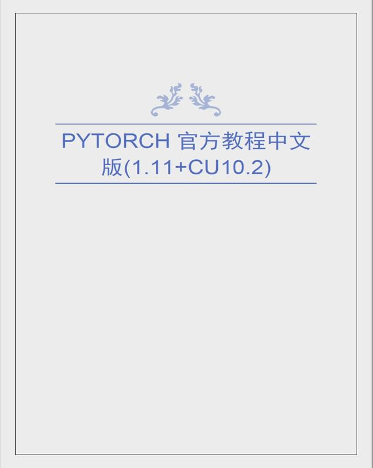</a> | <a href="https://pan.baidu.com/s/1y3LsWIXbHd0SF00Y5OLBTg?pwd=s2n3"> 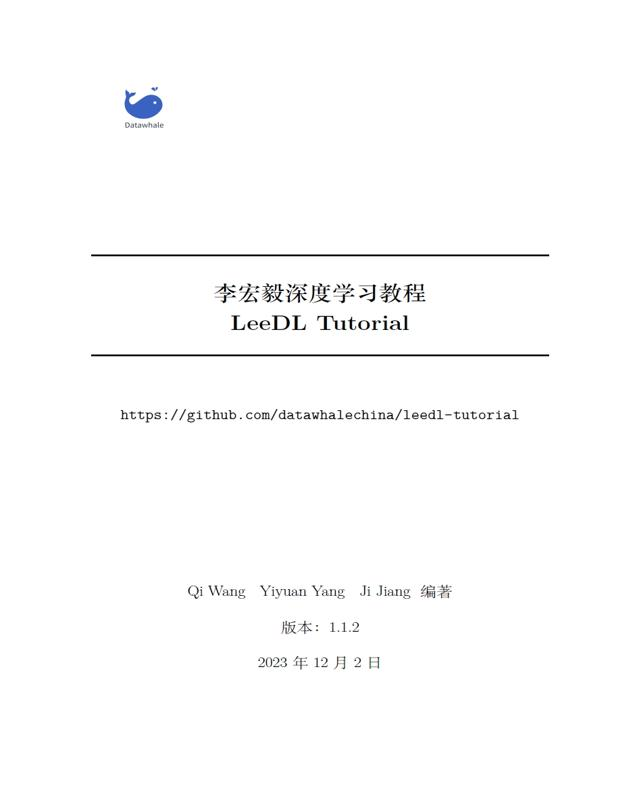</a> |  |  |
|---------------------------------------------------------------------------------------------------------------------------------|--------------------------------------------------------------------------------------------------------------------------------------------|---------------------------------------------------------------------------------------------------------------------------------|----------------------------------------------------------------------------------------------------------------------------------------|--------------------------------------------------------------------------------------------------------------------------------|
| <a href="https://www.alipan.com/s/rTZ1zSgqUb7">Python深度学习</a>                                                                   | <a href="https://www.alipan.com/s/y1ppAW7FDHA">Pytorch1.11.0 官方教程中文版</a>                                                                | <a href="https://www.alipan.com/s/a8Rvouprm59">李宏毅深度学习教程</a>                                                                    | <a href="https://www.alipan.com/s/HKf2kKM5Sew">深度学习笔记 (吴恩达) v5.72</a>                                                            | <a href="https://www.alipan.com/s/Tft741byWJz">深度学习原理与实践</a>                                                                   |

| <a href="https://pan.baidu.com/s/1HubSbBy_bbTksNAxJSFs3w?pwd=56bi"> 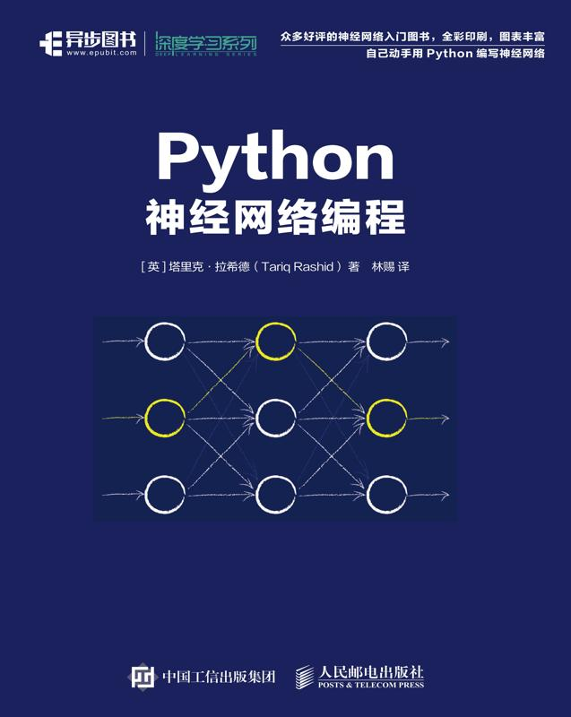</a> | <a href="https://pan.baidu.com/s/1qpQAgkd97_r_WV6T2mbfkw?pwd=ol72"> 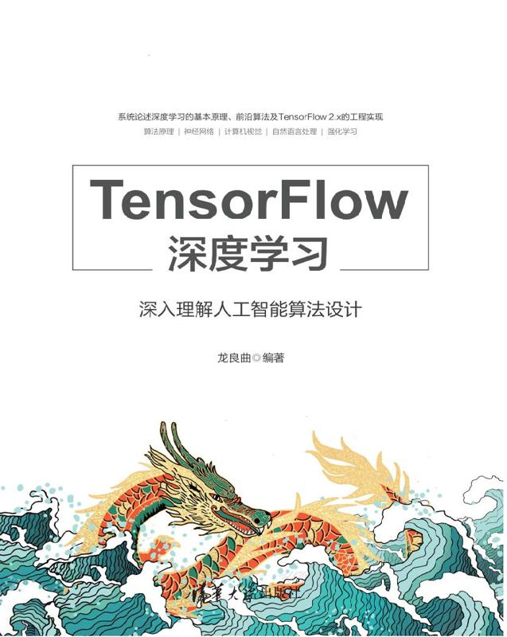</a> | <a href="https://pan.baidu.com/s/1PyKc7Ht_ALoTzNkZdis-Rg?pwd=6e9t"> 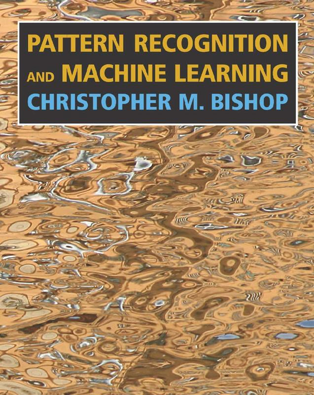</a> |  | <a href="https://pan.baidu.com/s/1XBq8GAfS_2zgbcgkf-3E-w?pwd=tyyw"> 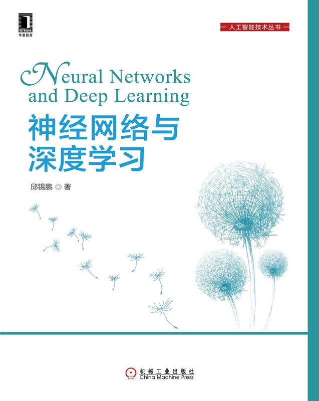</a> |
|-----------------------------------------------------------------------------------------------------------------------------------|--------------------------------------------------------------------------------------------------------------------------------------|---------------------------------------------------------------------------------------------------------------------------------|--------------------------------------------------------------------------------------------------------------------------------|--------------------------------------------------------------------------------------------------------------------------------|
| <a href="https://www.alipan.com/s/H5UaNgHV3UW">Python神经网络编程</a>                                                                   | <a href="https://www.alipan.com/s/UCnwBqptmpW">TensorFlow深度学习</a>                                                                    | <a href="https://www.alipan.com/s/cevaWHshvYB">模式识别与机器学习</a>                                                                    | <a href="https://www.alipan.com/s/cw5F41ccbAH">深度学习高手笔记</a>                                                                    | <a href="https://www.alipan.com/s/a8EP6g71nHe">神经网络与深度学习</a>                                                                   |

|  | <a href="https://pan.baidu.com/s/1ClwOfy3n3KkV36FrQ6RiCg?pwd=ybbw"> 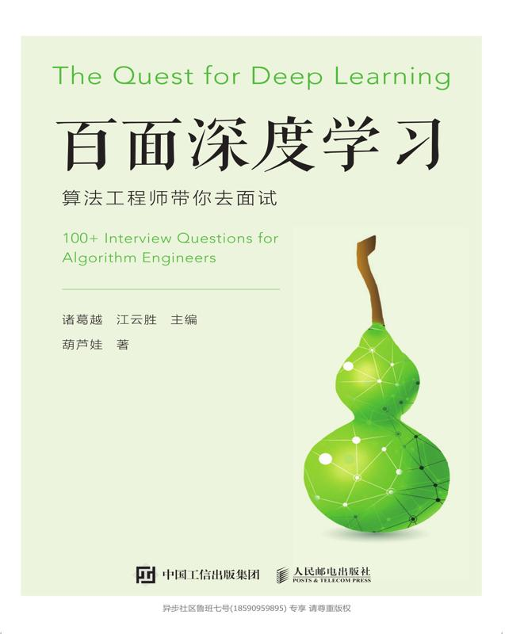</a> | <a href="https://pan.baidu.com/s/1lpFPP0BTmW0OO5ShlI4OYQ?pwd=zv4p"> 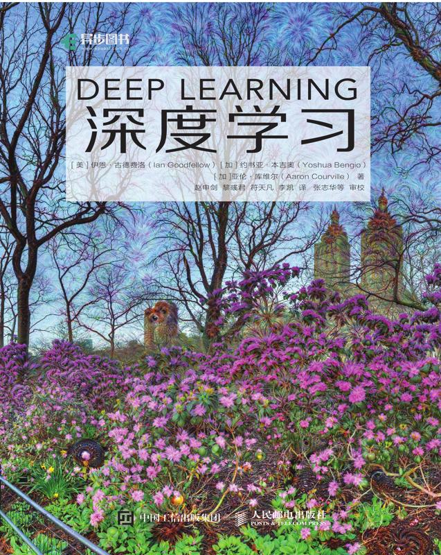</a> | <a href="https://pan.baidu.com/s/1pfMDtb9pL3WZ1yAaKHZ4Kw?pwd=pgx5"> 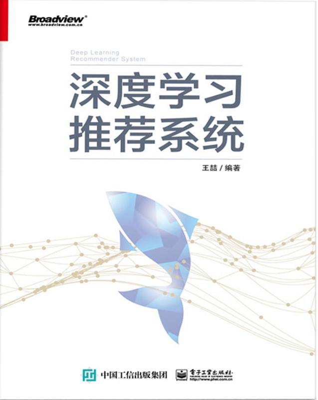</a> | <a href="https://pan.baidu.com/s/1PGI8efc4j8G4Mf5bWgkLIg?pwd=sojz"> 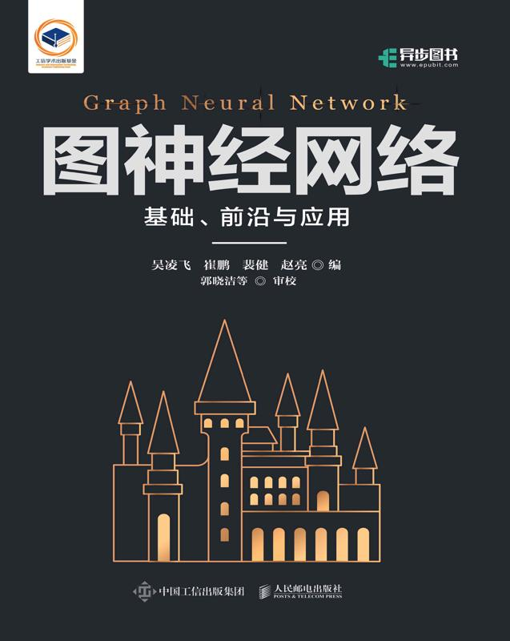</a> |
|-----------------------------------------------------------------------------------------------------------------------------------|------------------------------------------------------------------------------------------------------------------------------|----------------------------------------------------------------------------------------------------------------------------|--------------------------------------------------------------------------------------------------------------------------------|----------------------------------------------------------------------------------------------------------------------------|
| <a href="https://www.alipan.com/s/uojJDNrc4Xn">PyTorch 深度学习</a>                                                                   | <a href="https://www.alipan.com/s/zuqapRCnWVF">百面深度学习</a>                                                                    | <a href="https://www.alipan.com/s/XHkBrH8LPwZ">深度学习</a>                                                                    | <a href="https://www.alipan.com/s/AmsN18hhsVL">深度学习推荐系统</a>                                                                    | <a href="https://www.alipan.com/s/cwGfmeJ4ZFu">图神经网络</a>                                                                   |

图像处理

| <a href="https://pan.baidu.com/s/1jp6-zLbhYbl1VIBb7ZoBkw?pwd=pn9r"> 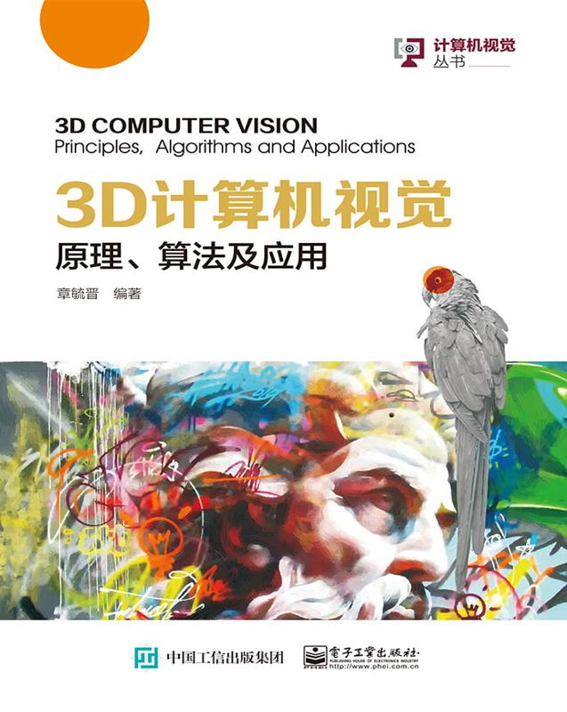</a> | <a href="https://pan.baidu.com/s/1s9q7-cLbiDTuvwahBrvnFQ?pwd=ut09"> 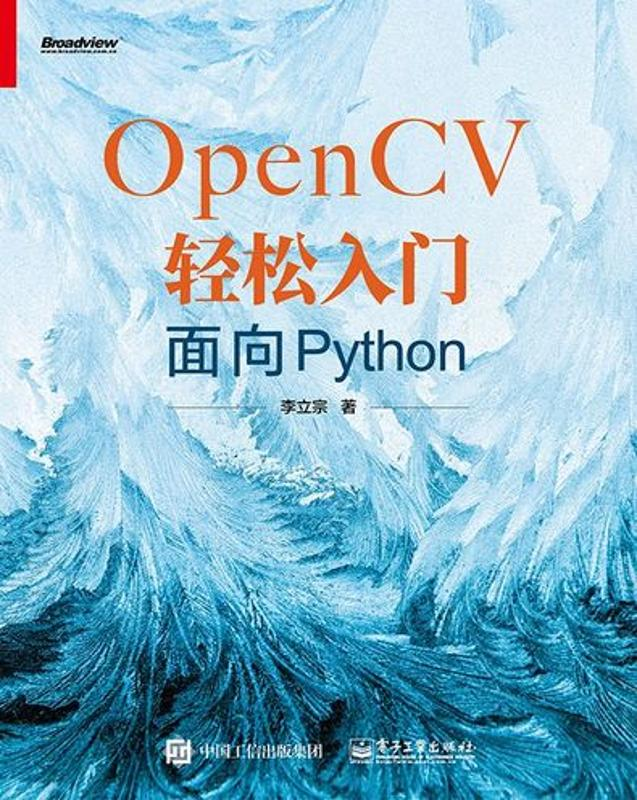</a> |  |  |  |
|------------------------------------------------------------------------------------------------------------------------------|-------------------------------------------------------------------------------------------------------------------------------------------|--------------------------------------------------------------------------------------------------------------------------------------|---------------------------------------------------------------------------------------------------------------------------------------|---------------------------------------------------------------------------------------------------------------------------------|
| <a href="https://www.alipan.com/s/qeL1RThVNyd">3d计算机视觉</a>                                                                   | <a href="https://www.alipan.com/s/QNswV2wgtLm">OpenCV轻松入门 面向Python</a>                                                                 | <a href="https://www.alipan.com/s/9J9xWn7Egjd">深度学习与目标 检测（第2版）</a>                                                                | <a href="https://www.alipan.com/s/b1CYEiYpRVD">视觉SLAM十四讲  (第2版)</a>                                                                | <a href="https://www.alipan.com/s/TLiZhx8ytq6">图像工程 (第4版)</a>                                                                   |

| <a href="https://pan.baidu.com/s/1v2mGyNUCpv51ARu-syj-Uw?pwd=11c6"> 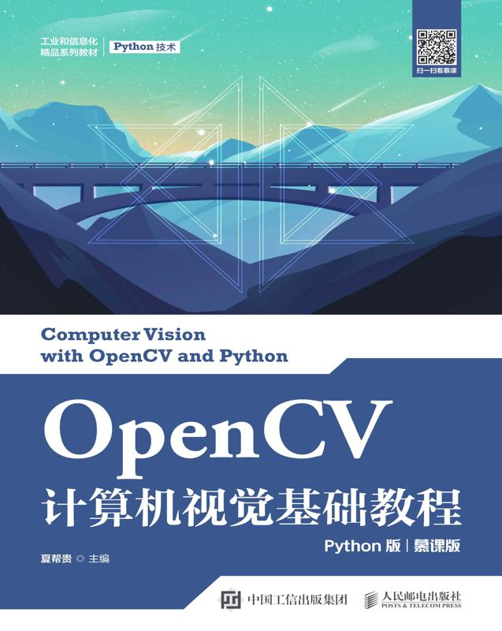</a> |  | <a href="https://pan.baidu.com/s/15RWziwPsYSWsVJhSvGtJPQ?pwd=ysvo"> 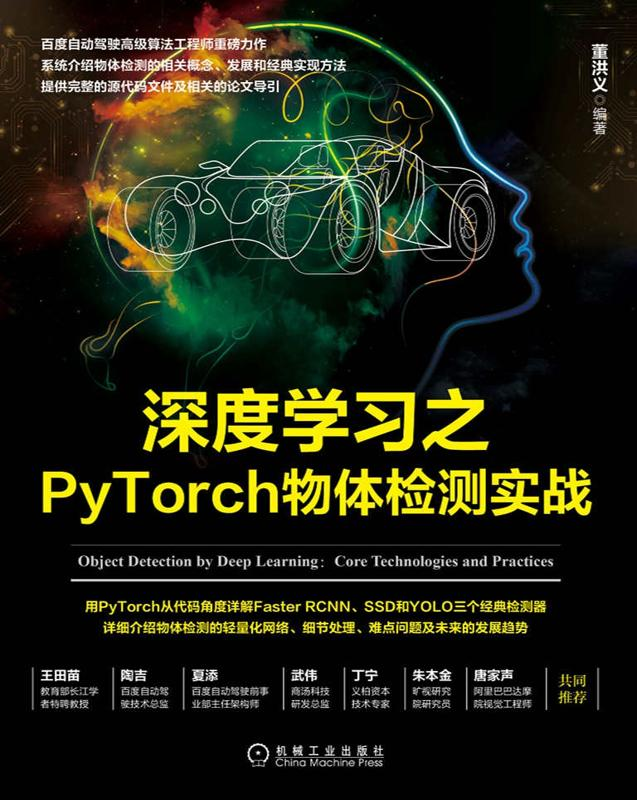</a> | <a href="https://pan.baidu.com/s/1v03E2QqQNYglQ8oqdgWSLA?pwd=xqte"> 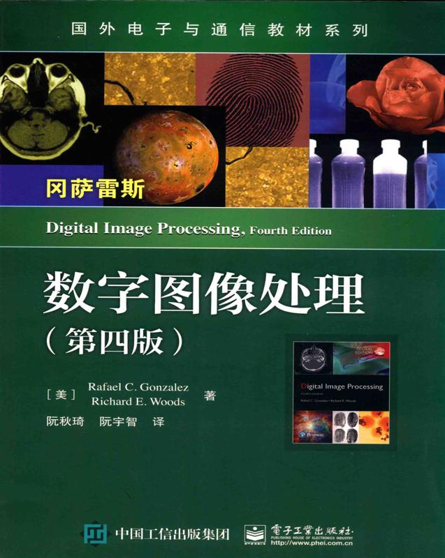</a> |
|-------------------------------------------------------------------------------------------------------------------------------------|---------------------------------------------------------------------------------------------------------------------------------------------|------------------------------------------------------------------------------------------------------------------------------------------|----------------------------------------------------------------------------------------------------------------------------------|
| <a href="https://www.alipan.com/s/pf6g5My7DQL">OpenCV计算机视觉教程</a>                                                                    | <a href="https://www.alipan.com/s/wYhUPcfXqcZ">深度学习入门 基于 Python的理论与实现</a>                                                                | <a href="https://www.alipan.com/s/LiisQ7vbRNQ">深度学习之PyTorch 物体检测实战</a>                                                                | <a href="https://www.alipan.com/s/U634MC1eXMp">数字图像处理 （第四版）</a>                                                               |

自然语言处理

|  |  | <a href="https://pan.baidu.com/s/19zi1BRaQMwVY4NfJPEu2AA?pwd=92r7"> 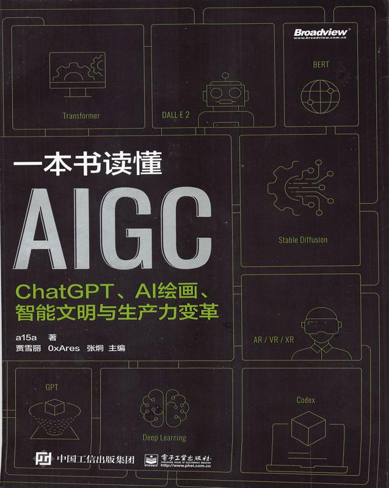</a> | <a href="https://pan.baidu.com/s/1JlQitXRMokHszLyQ1zBhyA?pwd=qo5a"> 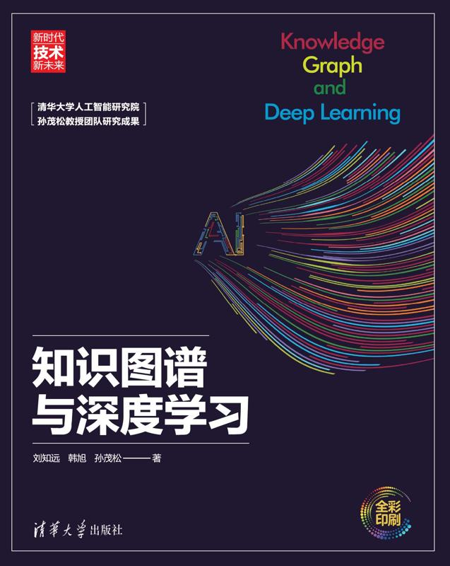</a> | <a href="https://pan.baidu.com/s/1B9H6D2yn9YE9Mxu-USHIDQ?pwd=pq5v"> 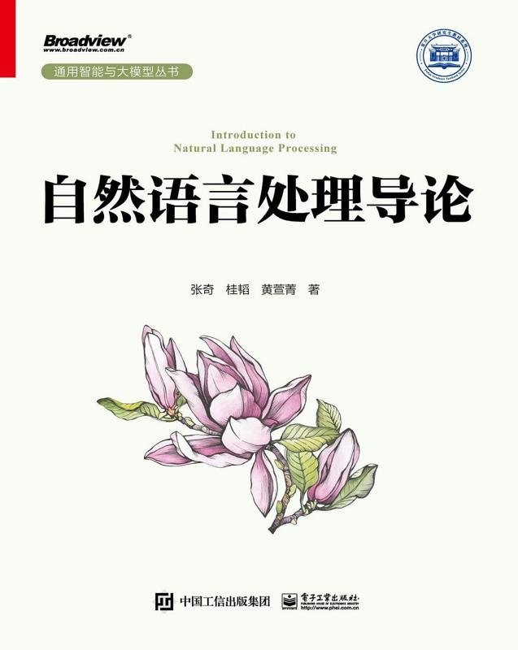</a> |
|---------------------------------------------------------------------------------------------------------------------------------|----------------------------------------------------------------------------------------------------------------------------------------|-----------------------------------------------------------------------------------------------------------------------------------------------------------|-----------------------------------------------------------------------------------------------------------------------------------|---------------------------------------------------------------------------------------------------------------------------------|
| <a href="https://www.alipan.com/s/ireH9QC4wqV">bert基础教程</a>                                                                     | <a href="https://www.alipan.com/s/dDzJfsRQJF7">大规模语言模型  从理论到实践</a>                                                                  | <a href="https://www.alipan.com/s/vxEUD1TVAQx">一本书读懂AIGC</a>                                                                                              | <a href="https://www.alipan.com/s/YVE8a9VAnte">知识图谱与深度学习</a>                                                                      | <a href="https://www.alipan.com/s/acmbhcEDKjY">自然语言处理导论</a>                                                                     |

|  |  | <a href="https://pan.baidu.com/s/1JporZgokMmNykogS-HRCxQ?pwd=ab62"> 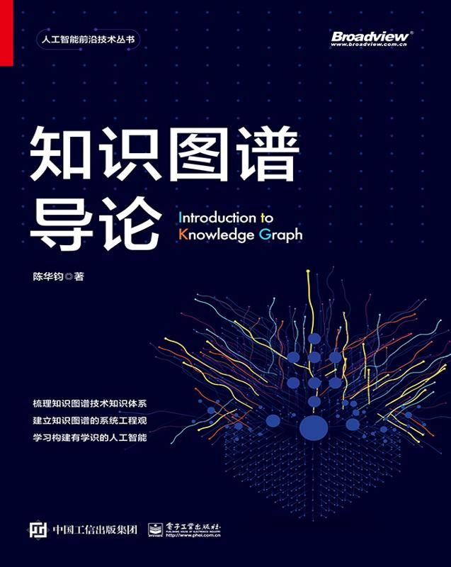</a> | <a href="https://pan.baidu.com/s/1CjW39q2H0f7YXhc_RGedpw?pwd=6pmf"> 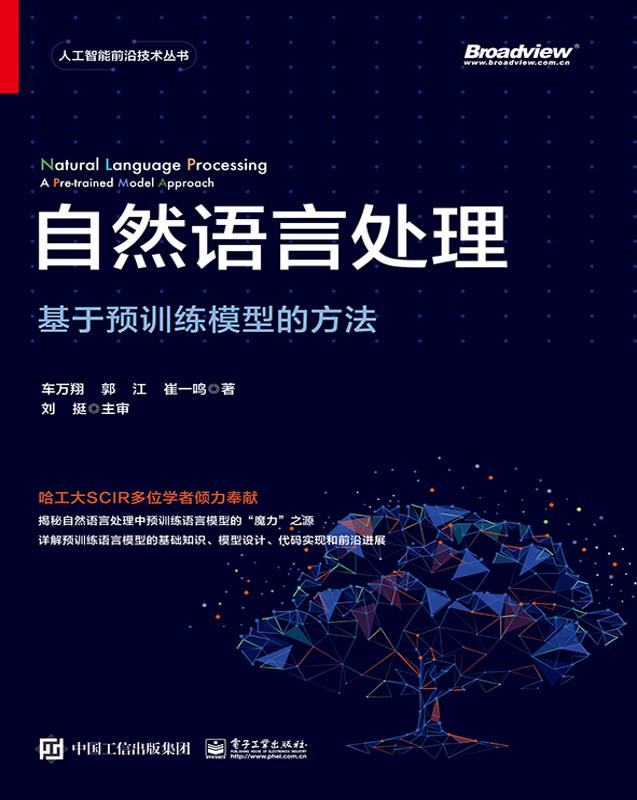</a> | <a href="https://pan.baidu.com/s/1WLNul7tVYHiznudSRxx9qQ?pwd=rpo4"> 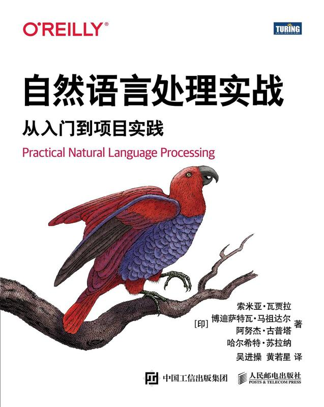</a> |
|--------------------------------------------------------------------------------------------------------------------------------------|---------------------------------------------------------------------------------------------------------------------------------------|--------------------------------------------------------------------------------------------------------------------------------|-------------------------------------------------------------------------------------------------------------------------------------------|---------------------------------------------------------------------------------------------------------------------------------|
| <a href="https://www.alipan.com/s/5XEpNdhDchF">pytorch自然语言处理</a>                                                                     | <a href="https://www.alipan.com/s/Pfa4niPFuwa">深度学习进阶  自然语言处理</a>                                                                  | <a href="https://www.alipan.com/s/KEs6FPXXfGK">知识图谱导论</a>                                                                      | <a href="https://www.alipan.com/s/xkcqApBpi9F">自然语言处理 基于预训练模型的方法</a>                                                                   | <a href="https://www.alipan.com/s/qWuY1ARVRvx">自然语言处理实战</a>                                                                     |

强化学习

|  | <a href="https://pan.baidu.com/s/1d23lHaKSBIXcMb32HIDTYw?pwd=7jtg"> 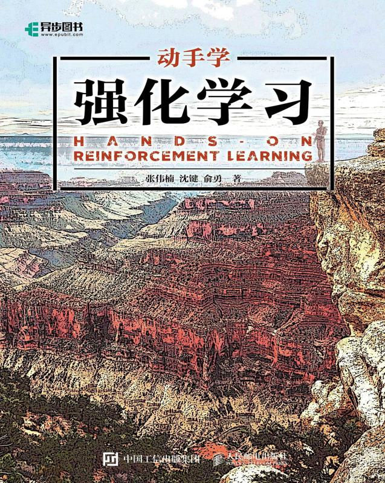</a> | <a href="https://pan.baidu.com/s/1T4jZkYqfkzXd7WqxKQzYfQ?pwd=lfke"> 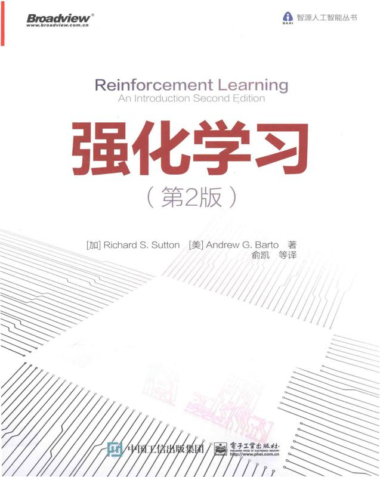</a> | <a href="https://pan.baidu.com/s/1m1qJ8iOTBu14pONZ6n3wpw?pwd=vhim"> 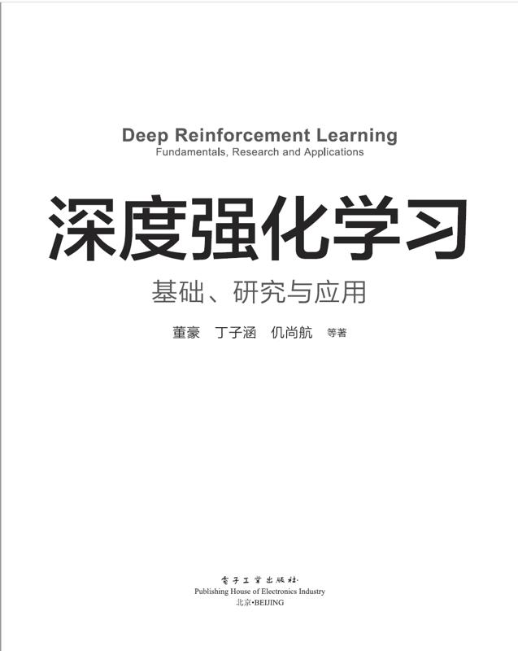</a> |
|-------------------------------------------------------------------------------------------------------------------------------------|-------------------------------------------------------------------------------------------------------------------------------|---------------------------------------------------------------------------------------------------------------------------------|-----------------------------------------------------------------------------------------------------------------------------|
| <a href="https://www.alipan.com/s/n9b5DfC9LC9">Easy RL 强化学习教程</a>                                                                | <a href="https://www.alipan.com/s/43xygTrhFc2">动手学强化学习</a>                                                                    | <a href="https://www.alipan.com/s/K61dxBbB6rM">强化学习（第2版）</a>                                                                    | <a href="https://www.alipan.com/s/S1FGMaf5qoP">深度强化学习</a>                                                                   |

# 生存指南

生存

| <a href="https://pan.baidu.com/s/1XOMCMUzi8ExWhKn4_cMkyg?pwd=koqy"> 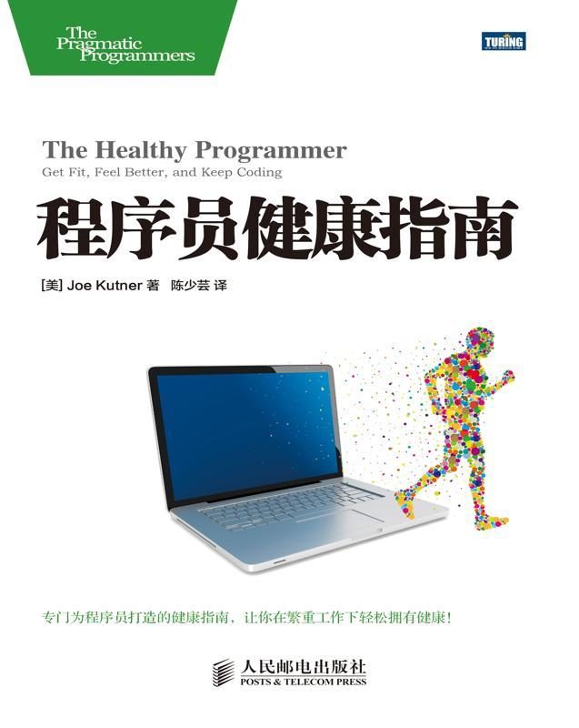</a> |  | <a href="https://pan.baidu.com/s/1LYBIVR08YFN-cOOkSjlOUg?pwd=8eub"> 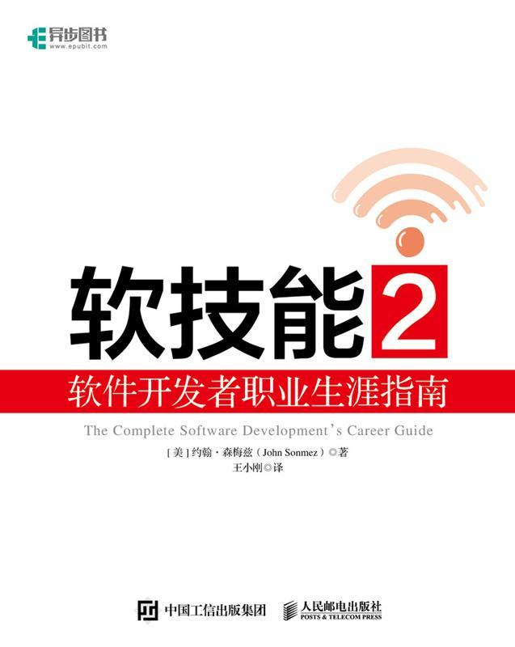</a> |
|-------------------------------------------------------------------------------------------------------------------------------|-------------------------------------------------------------------------------------------------------------------------------|---------------------------------------------------------------------------------------------------------------------------|
| <a href="https://www.alipan.com/s/7jFjyi7Arws">程序员健康指南 </a>                                                                   | <a href="https://www.alipan.com/s/tQqFoG1oZS1">软技能 第2版</a>                                                                    | <a href="https://www.alipan.com/s/5EwxCxYnq1K">软技能2</a>                                                                   |

面试

|  | <a href="https://pan.baidu.com/s/1MX1rULsMjvZh0EXeX3lPYA?pwd=frze"> 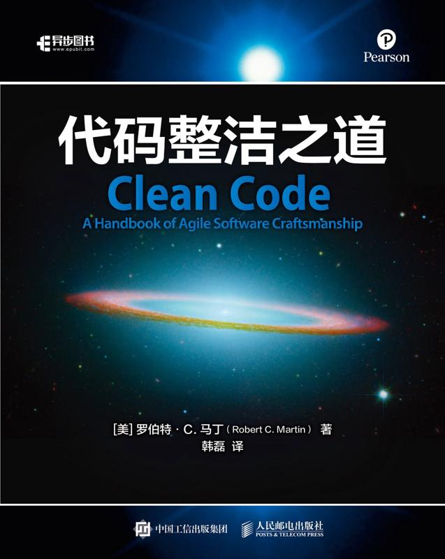</a> |  | <a href="https://pan.baidu.com/s/1zB7YpVFRy7dghEv5aTTJwQ?pwd=d8cx"> 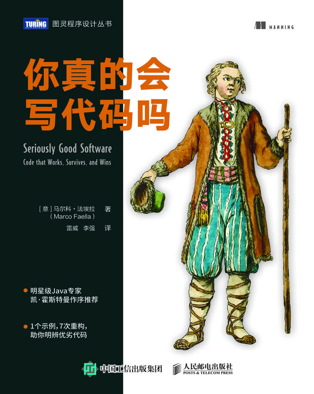</a> |  |
|---------------------------------------------------------------------------------------------------------------------------------|----------------------------------------------------------------------------------------------------------------------------|--------------------------------------------------------------------------------------------------------------------------------------------------|------------------------------------------------------------------------------------------------------------------------------|-----------------------------------------------------------------------------------------------------------------------------|
| <a href="https://www.alipan.com/s/1fhTQ9kZY9J">程序员面试金典 （第6版）</a>                                                             | <a href="https://www.alipan.com/s/FJ6tiQNFPBe">代码整洁之道</a>                                                                  | <a href="https://www.alipan.com/s/fR6dtxca4X6">剑指OFFER 名企面试 官精讲典型编程题  (第2版)</a>                                                            | <a href="https://www.alipan.com/s/nhmWQwwvjFZ">你真的会写代码吗</a>                                                                  | <a href="https://www.alipan.com/s/4QnVVtuFDdD">重构 (第2版)</a>                                                                 |

|  |  |  |
|----------------------------------------------------------------------------------------------------------------------------------|---------------------------------------------------------------------------------------------------------------------------------------|-----------------------------------------------------------------------------------------------------------------------------------|
| <a href="https://www.alipan.com/s/XxXvZvQZq5z">程序员修炼之道 （第2版）</a>                                                              | <a href="https://www.alipan.com/s/iJRWxsCL4JA">计算机程序的构造 和解释 (第2版)</a>                                                              | <a href="https://www.alipan.com/s/fR6dtxca4X6">剑指offer （专项突破版）</a>                                                             |

考证

| <a href="https://pan.baidu.com/s/1MS2In0K2vzMQIWoY-bTzNQ?pwd=s60t"> 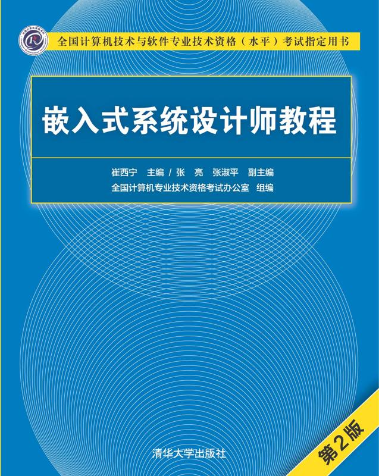</a> | <a href="https://pan.baidu.com/s/1IXIp00oIHoHgrDi3jOriMw?pwd=ygzj"> 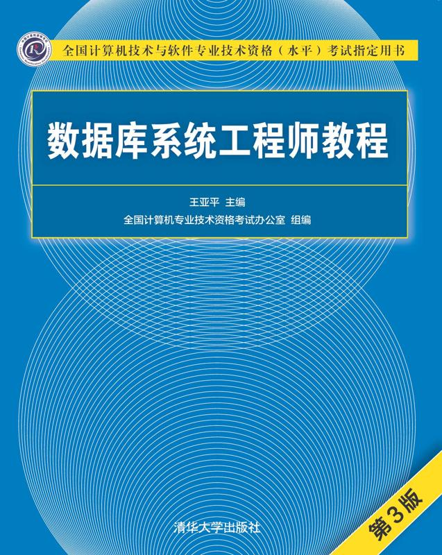</a> | <a href="https://pan.baidu.com/s/1lS79qiHiYmsaOTsICOcoBg?pwd=8dr4"> 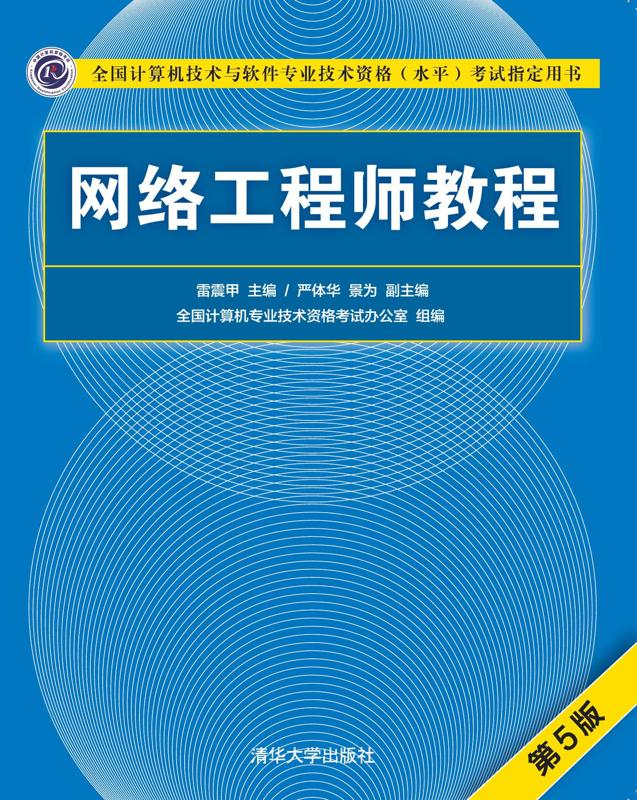</a> | <a href="https://pan.baidu.com/s/1J8bjlzZ7jghmb8c-Im8kBA?pwd=5evx"> 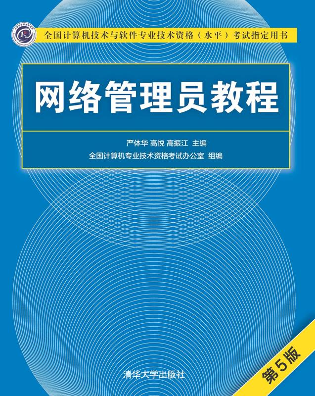</a> | <a href="https://pan.baidu.com/s/1HyBGpbrMgV0gJZmIEc8vLg?pwd=1hsr"> 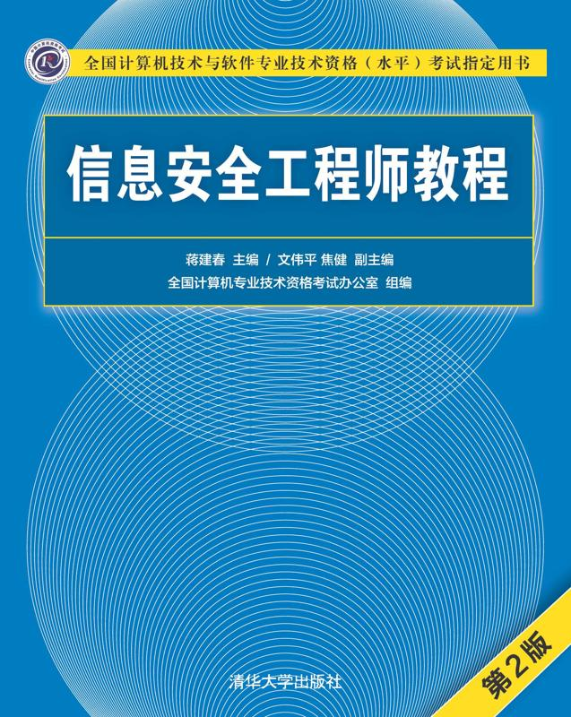</a> |
|------------------------------------------------------------------------------------------------------------------------------------|-------------------------------------------------------------------------------------------------------------------------------------|----------------------------------------------------------------------------------------------------------------------------------|----------------------------------------------------------------------------------------------------------------------------------|-----------------------------------------------------------------------------------------------------------------------------------|
| <a href="https://www.alipan.com/s/QXHUXanBQMW">嵌入式系统设计师 教程（第2版）</a>                                                             | <a href="https://www.alipan.com/s/jWLp3W29H8y">数据库系统工程师 教程（第3版）</a>                                                              | <a href="https://www.alipan.com/s/dRQ5L5MJH8K">网络工程师教程 （第5版）</a>                                                              | <a href="https://www.alipan.com/s/2JHzdhAjxFA">网络管理员教程 （第5版）</a>                                                              | <a href="https://www.alipan.com/s/3n3b2LCyYvz">信息安全工程师 教程（第2版）</a>                                                             |
| <a href="https://www.123pan.com/s/bjbgjv-jdHhh.html">直链下载</a>                                                     | <a href="https://www.123pan.com/s/bjbgjv-v3Hhh.html">直链下载</a>                                                      | <a href="https://www.123pan.com/s/bjbgjv-d3Hhh.html">直链下载</a>                                                   | <a href="https://www.123pan.com/s/bjbgjv-33Hhh.html">直链下载</a>                                                   | <a href="https://www.123pan.com/s/bjbgjv-VdHhh.html">直链下载</a>                                              |

| <a href="https://pan.baidu.com/s/1hI0ZXmUaMMyTdxLIewO6cA?pwd=1su0"> 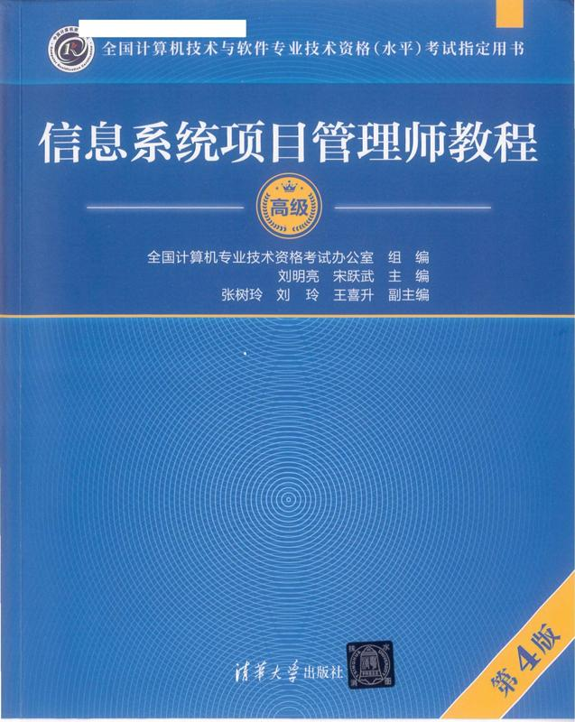</a> |
|-------------------------------------------------------------------------------------------------------------------------------------|
| <a href="https://www.alipan.com/s/45UNdgmt7N7">信息系统项目管理师 教程（第4版）</a>                                                             |
| <a href="https://www.123pan.com/s/bjbgjv-T3Hhh.html">直链下载</a>                                                      |

## 🤔 关于本人

 简介 

本人AI算法菜鸡一枚，因此书库中Python、Cpp、人工智能方面的书籍可能更全面一些。以下是自己绘制的AI算法技术栈，有不足的地方希望大家指正。



## 🔄 更新计划

🌟 增加更多的方向

🌟 增加英文原版书籍

🌟 细分各领域

## 🎉 看这里

如果觉得资源不错，可以请库主喝杯咖啡!

|  |  |
|------------------------------------------------|----------------------------------------------|
| 
 微信 
                          | 
 支付宝 
                       |

如果大家有经典的书籍本库没有收录的，欢迎PR。

欢迎star⭐ ，您的关注是我更新的动力。

## 🤝 致谢

感谢全体网友的分享，感谢全体网友的关注，感谢知识开源。

---

  

