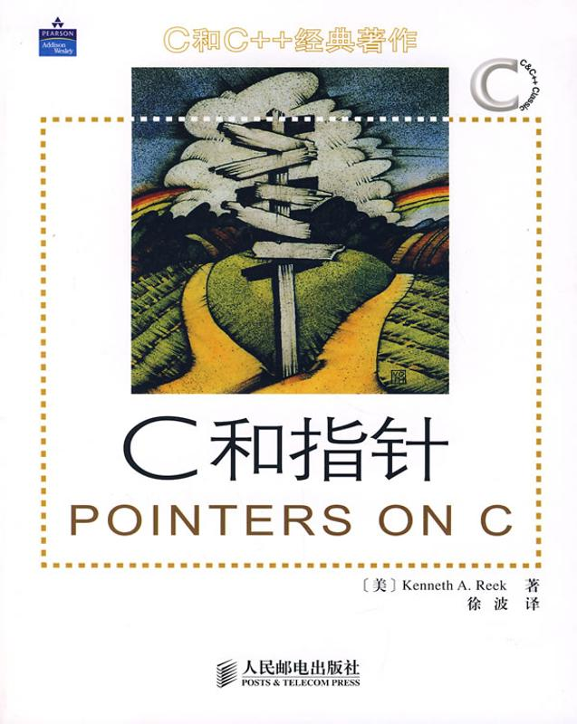

简体中文 | [English](README.md)
 

  

    
  

## 
计算机技术 优质书库

本储存库为从网络收集的一些关于计算机方向的电子书籍。
 
本书库的特点：

    1.精。书在于精而不在于多，所以我手机的书籍都是个方向经典书籍。
    2.质。一本质量高的电子书可以提升人的阅读兴趣，本书库收集的书籍敢说为全网质量最好的书籍，90%以上为原版书籍，仅仅10%左右为高清扫描版。
    3.新。本书库书籍保持最新版本，因为计算机技术迭代速度快，新书有利于新技术的学习。

本人在此承诺此书库仅供个人学习参考，不用于商业用途。如有侵权请联系本人删除。

C

|  |  |  |  |
|-------------------------------------------------------------------------------------------------------------------|--------------------------------------------------------------------------------------------------------------------------|-------------------------------------------------------------------------------------------------------------------------|-----------------------------------------------------------------------------------------------------------|
| C程序设计语言 （第2版）                                                                                                  | C语言程序设计 现代方法 (第2版)                                                                                                    | C语言程序设计 现代方法 (第2版修订版)                                                                                                | C和指针                                                                                                      |

Cpp

|  |  |  |  |  |
|-----------------------------------------------------------------------------------------------------------------------|-----------------------------------------------------------------------------------------------------------------------------|----------------------------------------------------------------------------------------------------------------------|---------------------------------------------------------------------------------------------------------------------|---------------------------------------------------------------------------------------------------------------------|
| C++ Primer (第5版)                                                                                                   | C++ Primer Plus (第6版)                                                                                                    | C++ 高级编程 (第4版)                                                                                                    | C++标准库 (第2版)                                                                                                     | C++程序设计语言 （特别版）                                                                                                  |

|  |  |  |  |  |
|----------------------------------------------------------------------------------------------------------------------------|---------------------------------------------------------------------------------------------------------------------------|--------------------------------------------------------------------------------------------------------------------|----------------------------------------------------------------------------------------------------------------------------|-------------------------------------------------------------------------------------------------------------------------|
| C++程序设计语言 第1～3部分（第4版）                                                                                                   | C++程序设计语言 第4部分（第4版）                                                                                                    | C++程序设计 （第3版)                                                                                                   | Effective Modern C++                                                                                                       | More Effective C++                                                                                                      |

C#

|  |  |  |
|-----------------------------------------------------------------------------------------------------------------|---------------------------------------------------------------------------------------------------------------------|--------------------------------------------------------------------------------------------------------------------|
| 深入理解C# （第3版）                                                                                                 | C 图解教程 (第5版)                                                                                                     | C 图解教程  (第4版)                                                                                                   |

如果觉得资源不错，可以请楼主喝杯咖啡!。

|  |  |
|------------------------------------------------|----------------------------------------------|
| 微信                                             | 支付宝                                          |

欢迎star⭐ ，您的关注是我更新的动力。